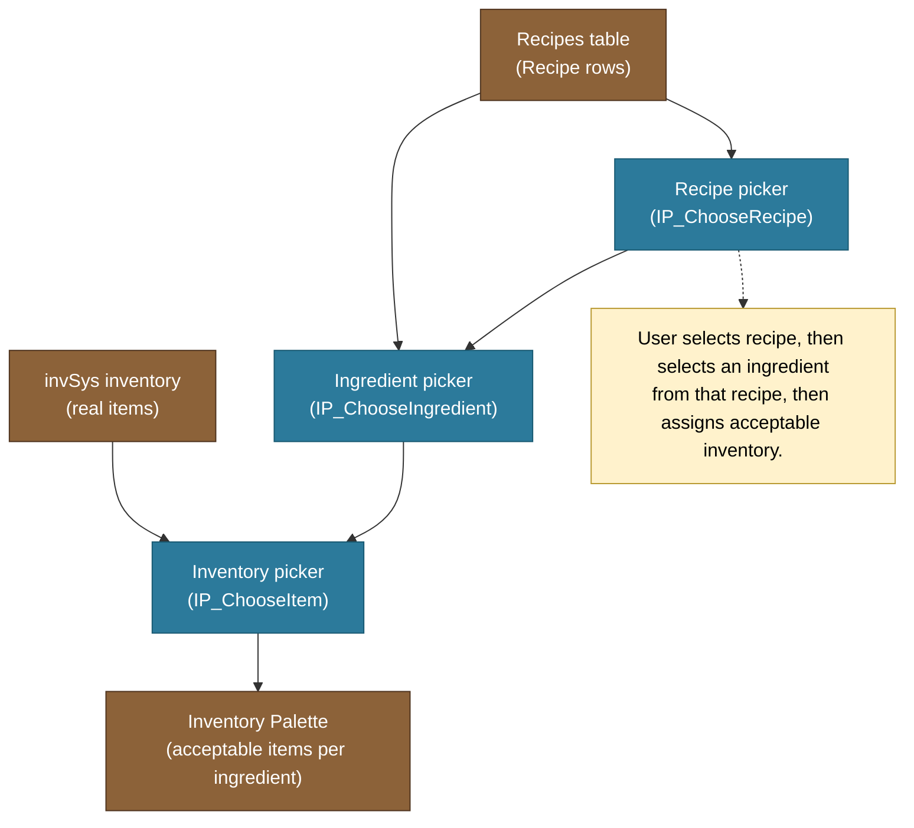
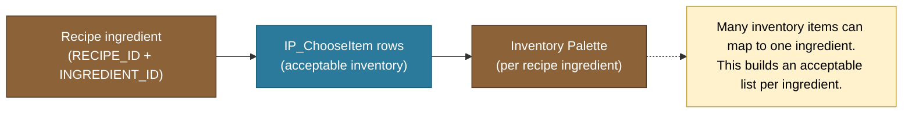

# Inventory Palette Builder (Production)

This doc captures System 2: Inventory Palette Builder (per recipe item, acceptable item list builder). It links recipe ingredients to real inventory items managed in invSys.

## What exists now
- `IP_ChooseRecipe` (picker table for selecting recipe)
- `IP_ChooseIngredient` (picker table for selecting ingredient from chosen recipe)
- `IP_ChooseItem` (picker table for selecting acceptable inventory items)
- `IngredientPalette` table headers: RECIPE_ID, INGREDIENT_ID, INPUT/OUTPUT, ITEM, PERCENT, UOM, AMOUNT, ROW, GUID
- Buttons:
  - `Save IngredientPalette` (save changes to IngredientPalette)
  - `Clear Inventory Palette Builder` (clear System 2 workspace)

## Builder flow (pickers + acceptable items)

## Map legend
- Blue nodes = picker tables on Production sheet.
- Brown nodes = source/target data tables.
- Yellow notes = user guidance.

## Data mapping (per ingredient)

## Notes / conventions
- System 2 is the Inventory Palette Builder in Production.
- Flow: pick recipe → pick ingredient → pick inventory items.
- Each ingredient can have multiple acceptable inventory items.
- Pickers are driven by existing data in Recipes + inventory tables.
