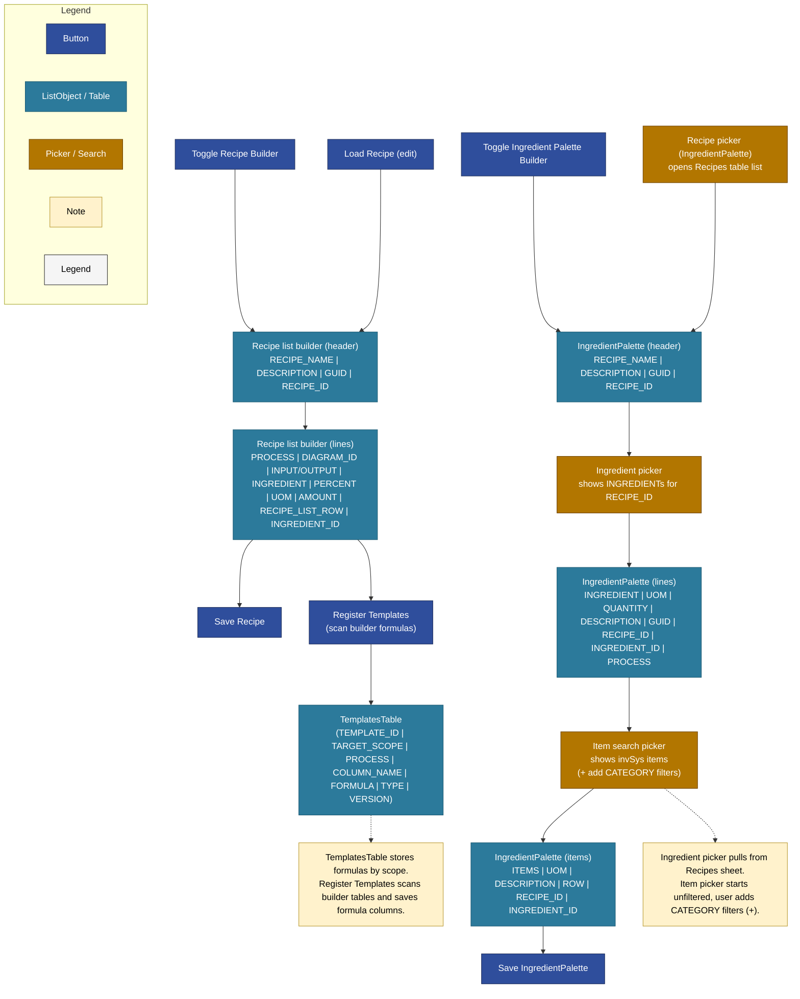
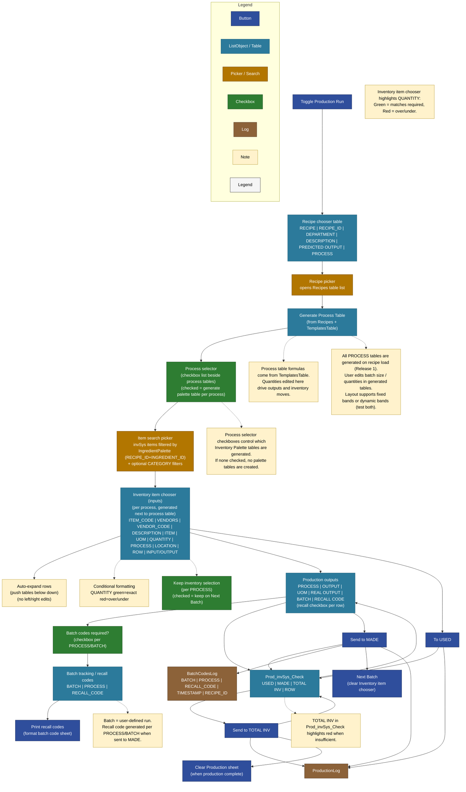

# Production System - User Workflow Diagrams (Draft)

## 1) Recipe Builder + Ingredient Palette (user-facing)

```mermaid
flowchart TD
    classDef btn fill:#2f4e9c,stroke:#1f2f5c,color:#ffffff;
    classDef list fill:#2c7a9b,stroke:#195a73,color:#ffffff;
    classDef picker fill:#b27600,stroke:#6f4300,color:#ffffff;
    classDef note fill:#fff2cc,stroke:#b99a33,color:#000000;
    classDef legend fill:#f5f5f5,stroke:#333333,color:#000000;

    Toggle["Toggle Recipe Builder"]:::btn
    TogglePalette["Toggle Ingredient Palette Builder"]:::btn
    LoadRecipe["Load Recipe (edit)"]:::btn
    SaveRecipe["Save Recipe"]:::btn
    SavePalette["Save IngredientPalette"]:::btn

    RecipeHeader["Recipe list builder (header)\nRECIPE_NAME | DESCRIPTION | GUID | RECIPE_ID"]:::list
    RecipeLines["Recipe list builder (lines)\nPROCESS | DIAGRAM_ID | INPUT/OUTPUT | INGREDIENT | PERCENT | UOM | AMOUNT | RECIPE_LIST_ROW | INGREDIENT_ID"]:::list

    TemplatesTable["TemplatesTable\n(TEMPLATE_ID | TARGET_SCOPE | PROCESS | COLUMN_NAME | FORMULA | TYPE | VERSION)"]:::list
    RegisterTemplates["Register Templates\n(scan builder formulas)"]:::btn

    PalettePicker["Recipe picker (IngredientPalette)\nopens Recipes table list"]:::picker
    IngredientPicker["Ingredient picker\nshows INGREDIENTs for RECIPE_ID"]:::picker
    PaletteHeader["IngredientPalette (header)\nRECIPE_NAME | DESCRIPTION | GUID | RECIPE_ID"]:::list
    PaletteLines["IngredientPalette (lines)\nINGREDIENT | UOM | QUANTITY | DESCRIPTION | GUID | RECIPE_ID | INGREDIENT_ID | PROCESS"]:::list
    PaletteItems["IngredientPalette (items)\nITEMS | UOM | DESCRIPTION | ROW | RECIPE_ID | INGREDIENT_ID"]:::list

    ItemPicker["Item search picker\nshows invSys items\n(+ add CATEGORY filters)"]:::picker

    Toggle --> RecipeHeader
    TogglePalette --> PaletteHeader
    LoadRecipe --> RecipeHeader
    RecipeHeader --> RecipeLines
    RecipeLines --> SaveRecipe
    RecipeLines --> RegisterTemplates --> TemplatesTable

    PalettePicker --> PaletteHeader
    PaletteHeader --> IngredientPicker --> PaletteLines
    PaletteLines --> ItemPicker --> PaletteItems
    PaletteItems --> SavePalette

    Note1["Ingredient picker pulls from Recipes sheet.\nItem picker starts unfiltered, user adds CATEGORY filters (+)."]:::note
    Note2["TemplatesTable stores formulas by scope.\nRegister Templates scans builder tables and saves formula columns."]:::note
    ItemPicker -.-> Note1
    TemplatesTable -.-> Note2

    subgraph Legend
        L1["Button"]:::btn
        L2["ListObject / Table"]:::list
        L3["Picker / Search"]:::picker
        L4["Note"]:::note
        L5["Legend"]:::legend
    end
```

## 2) Production Run (Recipe chooser → outputs → logs)

```mermaid
flowchart TD
    classDef btn fill:#2f4e9c,stroke:#1f2f5c,color:#ffffff;
    classDef list fill:#2c7a9b,stroke:#195a73,color:#ffffff;
    classDef picker fill:#b27600,stroke:#6f4300,color:#ffffff;
    classDef log fill:#8c6239,stroke:#4f341f,color:#ffffff;
    classDef note fill:#fff2cc,stroke:#b99a33,color:#000000;
    classDef legend fill:#f5f5f5,stroke:#333333,color:#000000;
    classDef chk fill:#2e7d32,stroke:#1b4f1f,color:#ffffff;

    ToggleProd["Toggle Production Run"]:::btn
    RecipeChooser["Recipe chooser table\nRECIPE | RECIPE_ID | DEPARTMENT | DESCRIPTION | PREDICTED OUTPUT | PROCESS"]:::list
    ProcessSelector["Process selector\n(checkbox list beside process tables)\n(checked = generate palette table per process)"]:::chk
    BatchCodesToggle["Batch codes required?\n(checkbox per PROCESS/BATCH)"]:::chk
    RecipePicker["Recipe picker\nopens Recipes table list"]:::picker
    BuildProcessTable["Generate Process Table\n(from Recipes + TemplatesTable)"]:::list

    ItemPicker2["Item search picker\ninvSys items filtered by\nIngredientPalette (RECIPE_ID+INGREDIENT_ID)\n+ optional CATEGORY filters"]:::picker
    InventoryInputs["Inventory item chooser (inputs)\n(per process, generated next to process table)\nITEM_CODE | VENDORS | VENDOR_CODE | DESCRIPTION | ITEM | UOM | QUANTITY | PROCESS | LOCATION | ROW | INPUT/OUTPUT"]:::list
    KeepInventory["Keep inventory selection\n(per PROCESS)\n(checked = keep on Next Batch)"]:::chk
    ProductionOutputs["Production outputs\nPROCESS | OUTPUT | UOM | REAL OUTPUT | BATCH | RECALL CODE\n(recall checkbox per row)"]:::list

    BatchCodes["Batch tracking / recall codes\nBATCH | PROCESS | RECALL_CODE"]:::list
    BatchCodesLog["BatchCodesLog\nBATCH | PROCESS | RECALL_CODE | TIMESTAMP | RECIPE_ID"]:::log
    PrintCodes["Print recall codes\n(format batch code sheet)"]:::btn
    CheckInv["Prod_invSys_Check\nUSED | MADE | TOTAL INV | ROW"]:::list
    ToUsed["To USED"]:::btn
    SendTotal["Send to TOTAL INV"]:::btn
    ToMade["Send to MADE"]:::btn
    ProductionLog["ProductionLog"]:::log

    NextBatch["Next Batch\n(clear Inventory item chooser)"]:::btn
    ClearProd["Clear Production sheet\n(when production complete)"]:::btn

    ToggleProd --> RecipeChooser --> RecipePicker --> BuildProcessTable
    BuildProcessTable --> ProcessSelector
    ProcessSelector --> ItemPicker2 --> InventoryInputs
    InventoryInputs --> ExpandRows["Auto-expand rows\n(push tables below down)\n(no left/right edits)"]:::note
    InvChooserCF["Conditional formatting\nQUANTITY green=exact red=over/under"]:::note
    InventoryInputs -.-> InvChooserCF
    InventoryInputs -.-> KeepInventory
    InventoryInputs --> ProductionOutputs
    ProductionOutputs --> BatchCodesToggle --> BatchCodes --> PrintCodes
    ProductionOutputs --> CheckInv

    InventoryInputs --> ToUsed --> CheckInv
    CheckInv --> ProductionOutputs
    ProductionOutputs --> ToMade --> CheckInv
    ToMade --> BatchCodesLog
    ToMade --> NextBatch
    CheckInv --> SendTotal --> CheckInv

    ToUsed --> ProductionLog
    ToMade --> ProductionLog
    SendTotal --> ProductionLog

    SendTotal --> ClearProd

    Note2["Process table formulas come from TemplatesTable.\nQuantities edited here drive outputs and inventory moves."]:::note
    Note4["Inventory item chooser highlights QUANTITY:\nGreen = matches required, Red = over/under."]:::note
    Note6["TOTAL INV in Prod_invSys_Check highlights red when insufficient."]:::note
    CheckInv -.-> Note6
    Note7["Batch = user-defined run.\nRecall code generated per PROCESS/BATCH when sent to MADE."]:::note
    BatchCodes -.-> Note7
    Note5["Process selector checkboxes control which\nInventory Palette tables are generated.\nIf none checked, no palette tables are created."]:::note
    ProcessSelector -.-> Note5
    BuildProcessTable -.-> Note2
    Note3["All PROCESS tables are generated on recipe load (Release 1).\nUser edits batch size / quantities in generated tables.\nLayout supports fixed bands or dynamic bands (test both)."]:::note
    BuildProcessTable -.-> Note3

    subgraph Legend
        L1["Button"]:::btn
        L2["ListObject / Table"]:::list
        L3["Picker / Search"]:::picker
        L7["Checkbox"]:::chk
        L4["Log"]:::log
        L5["Note"]:::note
        L6["Legend"]:::legend
    end
```
