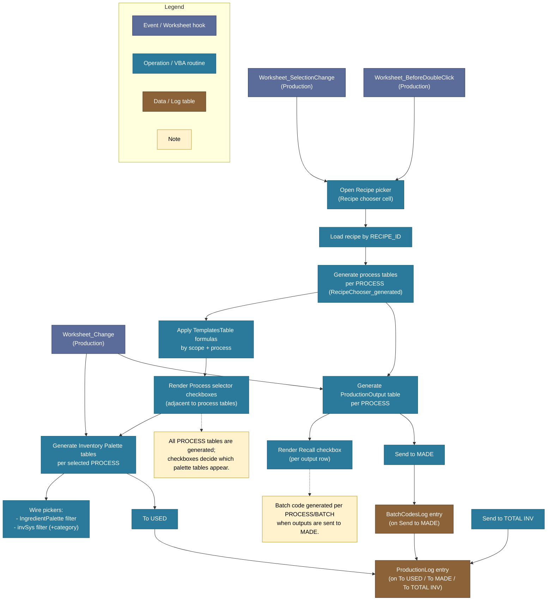
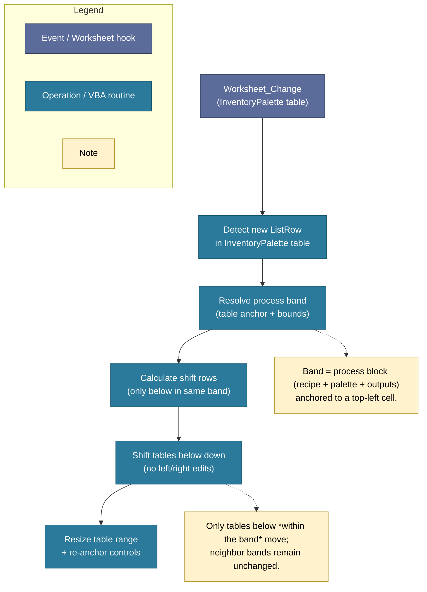
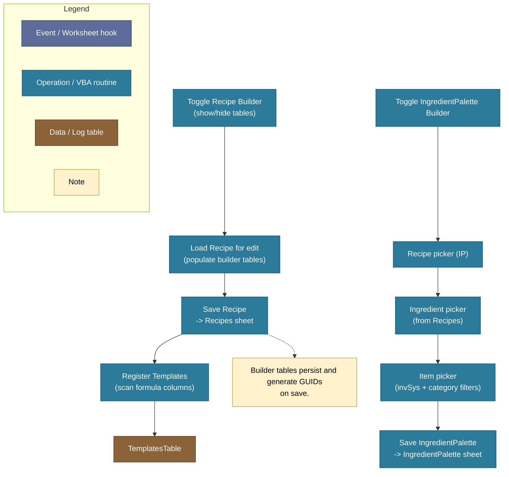

# Production System - VBA Perspective Diagrams (Draft)

These diagrams describe *how the VBA behaves* (events, table generation, layout handling).
They are not user-facing workflows.

## 1) Production Run - Event & Generation Flow (VBA view)

## 2) Inventory Palette Auto-Expand (VBA layout detail)

## 3) Recipe Builder & Ingredient Palette Builder (VBA view)

