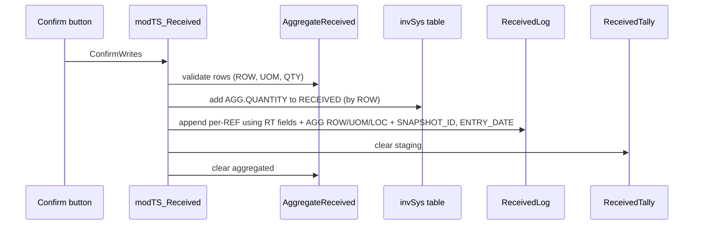

# Confirm Writes — data and operations

The diagram below shows exactly what the code does to each header during Confirm Writes. Arrows are annotated with the operation (add, copy, check, concatenate, generate).

```mermaid
flowchart TD
  %% Staging (per REF)
  subgraph STG["ReceivedTally (staging)"]
    RT_REF["REF_NUMBER"]
    RT_ITEM["ITEMS"]
    RT_QTY["QUANTITY"]
  end

  %% Aggregated rows (per invSys ROW)
  subgraph AGG["AggregateReceived"]
    AGG_ROW["ROW (resolved invSys row)"]
    AGG_ITEM_CODE["ITEM_CODE"]
    AGG_ITEM["ITEM"]
    AGG_QTY["QUANTITY (sum per ROW)"]
    AGG_UOM["UOM"]
    AGG_LOC["LOCATION"]
    AGG_REF_SHOW["REF_NUMBER (concat display)"]
  end

  %% Destination tables
  subgraph INV["invSys"]
    INV_ROW["ROW"]
    INV_REC["RECEIVED"]
  end

  subgraph LOG["ReceivedLog"]
    LOG_REF["REF_NUMBER"]
    LOG_ITEM["ITEMS"]
    LOG_QTY["QUANTITY (per REF)"]
    LOG_UOM["UOM"]
    LOG_ROW["ROW"]
    LOG_LOC["LOCATION"]
    LOG_SNAP["SNAPSHOT_ID (NewGuid)"]
    LOG_DATE["ENTRY_DATE (Now)"]
  end

  %% Operations to invSys
  AGG_ROW --> INV_ROW
  AGG_QTY -->|add to| INV_REC

  %% Operations to ReceivedLog (per staging row)
  RT_REF -->|copy| LOG_REF
  RT_ITEM -->|copy| LOG_ITEM
  RT_QTY -->|copy| LOG_QTY
  AGG_UOM -->|copy| LOG_UOM
  AGG_LOC -->|copy| LOG_LOC
  AGG_ROW -->|copy| LOG_ROW
  LOG_SNAP -.generated.- LOG_SNAP
  LOG_DATE -.generated.- LOG_DATE

  %% Internal aggregation rules
  RT_REF -->|concat display| AGG_REF_SHOW
  RT_QTY -->|sum by ROW| AGG_QTY

  %% Notes
  classDef note fill:#fff7c7,stroke:#d4b106,color:#222,font-size:11px;
  note1[[ROW is the merge key; REF_NUMBER concatenates for display only]]:::note
  note2[[invSys update = INV.RECEIVED + AGG.QUANTITY per ROW]]:::note
  note3[[ReceivedLog keeps per-REF QUANTITY from staging]]:::note
  note4[[AGG.ROW is used to locate invSys row; it never overwrites invSys.ROW]]:::note
  note5[[AggregateReceived table should be protected/read-only to prevent user edits]]:::note

  note1 --- AGG_ROW
  note2 --- INV_REC
  note3 --- LOG_QTY
  note4 --- INV_ROW
  note5 --- AGG
```

## VBA call stack (simplified)

