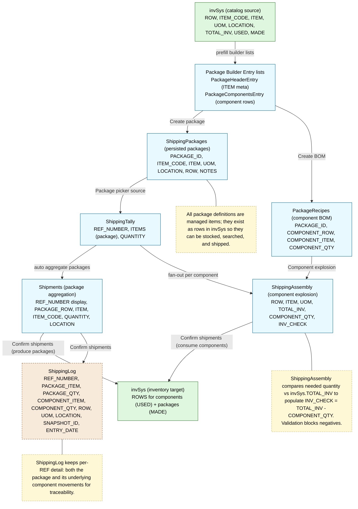
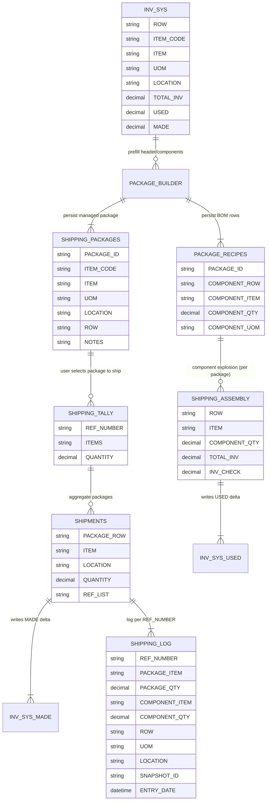

Data Contracts (Shipping tables/lists) – Mermaid
===============================================

Flowchart
---------

Block Diagram (relationships & merge rules)
-------------------------------------------

```mermaid
block-beta
columns 4
  INV_SRC["invSys catalog"]
  PKG_HDR["ShippingPackages\n(package headers)"]
  PKG_REC["PackageRecipes\n(component rows)"]
  SHIP_TALLY["ShippingTally\n(REF_NUMBER, ITEMS, QUANTITY)"]
  blockArrowINVPKG<["Lookup invSys rows to prefill header + components"]>(right)
  blockArrowPKGREC<["Package creation writes header + BOM to ShippingBOM"]>(right)
  blockArrowPKGSHIP<["Picker pulls only managed packages (those with PACKAGE_ID + ROW)"]>(right)
  blockArrowSHIPASSY<["Explode BOM × quantity; group by component ROW"]>(right)
  blockArrowSHIPAGG<["Group packages by ROW/ITEM"]>(right)
  blockArrowASSYINV<["Confirm: add COMPONENT_QTY to invSys.USED"]>(down)
  blockArrowAGGINV<["Confirm: add package QUANTITY to invSys.MADE"]>(down)
  blockArrowAGGLOG<["Confirm: append ShippingLog per REF_NUMBER"]>(down)
  SHIP_ASSY["ShippingAssembly\n(ROW, ITEM, COMPONENT_QTY, INV_CHECK)"]
  SHIP_AGG["Shipments\n(PACKAGE_ROW, ITEM, QUANTITY, LOCATION)"]
  SHIPPING_LOG["ShippingLog\n(package + component trace)"]
  INV_TARGET["invSys target rows\ncomponents (USED) + packages (MADE)"]
  style INV_SRC fill:#dff7df,stroke:#2f6f2f,stroke-width:2px
  style PKG_HDR fill:#e8f9ff,stroke:#2c7a9b,stroke-width:2px
  style PKG_REC fill:#e8f9ff,stroke:#2c7a9b,stroke-width:2px
  style SHIP_TALLY fill:#e8f9ff,stroke:#2c7a9b,stroke-width:2px
  style SHIP_ASSY fill:#e8f9ff,stroke:#2c7a9b,stroke-width:2px
  style SHIP_AGG fill:#e8f9ff,stroke:#2c7a9b,stroke-width:2px
  style INV_TARGET fill:#dff7df,stroke:#2f6f2f,stroke-width:2px
  style SHIPPING_LOG fill:#f7eadb,stroke:#8c6239,stroke-width:2px,stroke-dasharray:4 3
```

Entity Relationship View
------------------------

