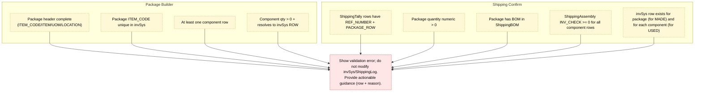

Validation & Error Rules – Shipping
==================================

Checklist
---------
- **Builder phase**
  - Header required fields: ITEM_CODE, ITEM, UOM, LOCATION, optional NOTES.
  - ITEM_CODE must not already exist in invSys; builder refuses to overwrite.
  - Components: at least one line; each resolves to an invSys ROW via ITEM/ITEM_CODE and quantity > 0.
- **Shipping tally / confirm**
  - `ShippingTally` row cannot be blank (REF/ITEM/QTY) and must map to a package defined in ShippingBOM.
  - BOM explosion runs before confirm; confirm checks `INV_CHECK` (TOTAL_INV - needed) is >= 0 for every component row.
  - Package and component rows must have valid invSys ROW to target USED/MADE columns.
  - Snapshot/log metadata (REF_NUMBER, ENTRY_DATE, SNAPSHOT_ID) required for ShippingLog writes.

Behavior on Success
-------------------
- Builder: package header + recipe stored in `ShippingBOM`; new/updated package row added to invSys (managed inventory item with MADE=0, USED=0 baseline).
- Confirm: adds `ShippingAssembly.COMPONENT_QTY` to `invSys.USED`; adds `Shipments.QUANTITY` to `invSys.MADE`; appends ShippingLog rows per REF_NUMBER; clears ShippingTally/Assembly/Shipments; primes undo stack.

Behavior on Failure
-------------------
- Builder: aborts save; no writes to ShippingBOM or invSys.
- Confirm: no writes to invSys or ShippingLog; component/aggregation tables remain on screen for edits; undo/redo state unchanged.

Surface & UX
------------
- Builder validations fire immediately on button click; highlight the specific header/component cells.
- Shipping Confirm displays aggregated failure text grouped by condition (e.g., “Component ROW 312 (Tape 2X110) short by 45 units”).
- Provide quick link instructions (“Use Package Builder to complete package definition”) when BOM missing.

Error Codes (suggested)
-----------------------
| Code   | Condition                                       | Suggested message                                      |
|--------|-------------------------------------------------|--------------------------------------------------------|
| PB-HDR | Missing ITEM_CODE/ITEM/UOM/LOCATION             | “Package header incomplete; fill in code, name, UOM, location.” |
| PB-DUP | ITEM_CODE already exists in invSys              | “Package ITEM_CODE already exists; choose another.”    |
| PB-BOM | No component rows / qty <= 0                    | “Add at least one component with quantity > 0.”        |
| PB-LNK | Component cannot resolve to invSys ROW          | “Component ‘{name}’ not found in invSys.”              |
| SH-REF | ShippingTally row missing REF or package        | “Enter a REF_NUMBER and choose a defined package.”     |
| SH-QTY | Shipping quantity invalid                       | “Quantity must be a number greater than 0.”            |
| SH-BOM | Package has no BOM (ShippingBOM missing)        | “Package 'X' is not configured; open Package Builder.” |
| SH-INV | Component shortage (INV_CHECK < 0)              | “Not enough '{item}'; shortage {abs value}.”           |
| SH-ROW | invSys row missing for package/component        | “Row {n} missing in invSys; refresh catalog.”          |

Notes
-----
- Undo/Redo only captures successful confirm batches; builder saves are standalone and should be guarded by Excel’s native undo if editing manually.
- ShippingAssembly recalculates after every edit; it is the preview for inventory sufficiency, so surfacing `INV_CHECK` there avoids hidden surprises at confirm time.
