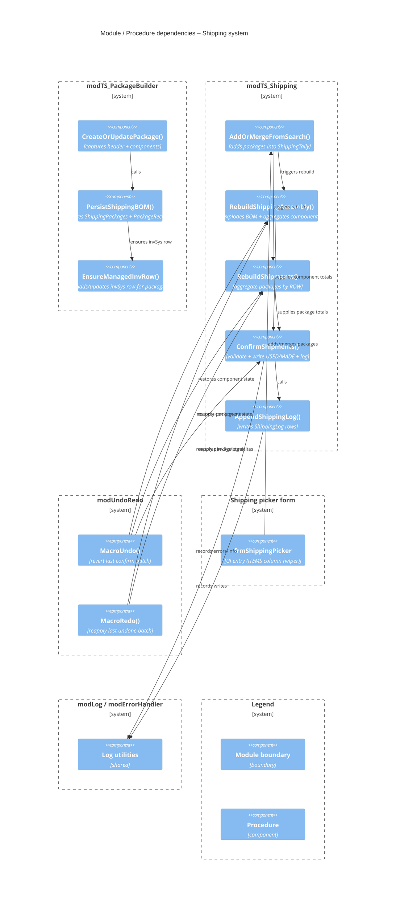

Module/Procedure Dependency – Shipping (C4 style)
=================================================

```mermaid
C4Component
title Module / Procedure dependencies – Shipping system

Boundary(modPkg_b, "modTS_PackageBuilder") {
  Component(PB1, "CreateOrUpdatePackage()", "captures header + components")
  Component(PB2, "PersistShippingBOM()", "writes ShippingPackages + PackageRecipes")
  Component(PB3, "EnsureManagedInvRow()", "adds/updates invSys row for package")
}

Boundary(modShip_b, "modTS_Shipping") {
  Component(SH1, "AddOrMergeFromSearch()", "adds packages into ShippingTally")
  Component(SH2, "RebuildShippingAssembly()", "explodes BOM + aggregates components")
  Component(SH3, "RebuildShipments()", "aggregate packages by ROW")
  Component(SH4, "ConfirmShipments()", "validate + write USED/MADE + log")
  Component(SH5, "AppendShippingLog()", "writes ShippingLog rows")
}

Boundary(modUndo_b, "modUndoRedo") {
  Component(U1, "MacroUndo()", "revert last confirm batch")
  Component(U2, "MacroRedo()", "reapply last undone batch")
}

Boundary(forms_b, "Shipping picker form") {
  Component(F1, "frmShippingPicker", "UI entry (ITEMS column helper)")
}

Boundary(log_b, "modLog / modErrorHandler") {
  Component(LOG, "Log utilities", "shared")
}

Rel(PB1, PB2, "calls")
Rel(PB2, PB3, "ensures invSys row")
Rel(F1, SH1, "adds/merges packages")
Rel(SH1, SH2, "triggers rebuild")
Rel(SH1, SH3, "triggers rebuild")
Rel(SH2, SH4, "supplies component totals")
Rel(SH3, SH4, "supplies package totals")
Rel(SH4, SH5, "calls")
Rel(SH4, LOG, "records errors/info")
Rel(SH5, LOG, "records writes")
Rel(U1, SH2, "restores component state")
Rel(U1, SH3, "restores package state")
Rel(U1, SH4, "restores invSys/log deltas")
Rel(U2, SH2, "reapply component state")
Rel(U2, SH3, "reapply package state")

Boundary(legend, "Legend") {
  Component(LB, "Module boundary", "boundary")
  Component(LC, "Procedure", "component")
}
```
