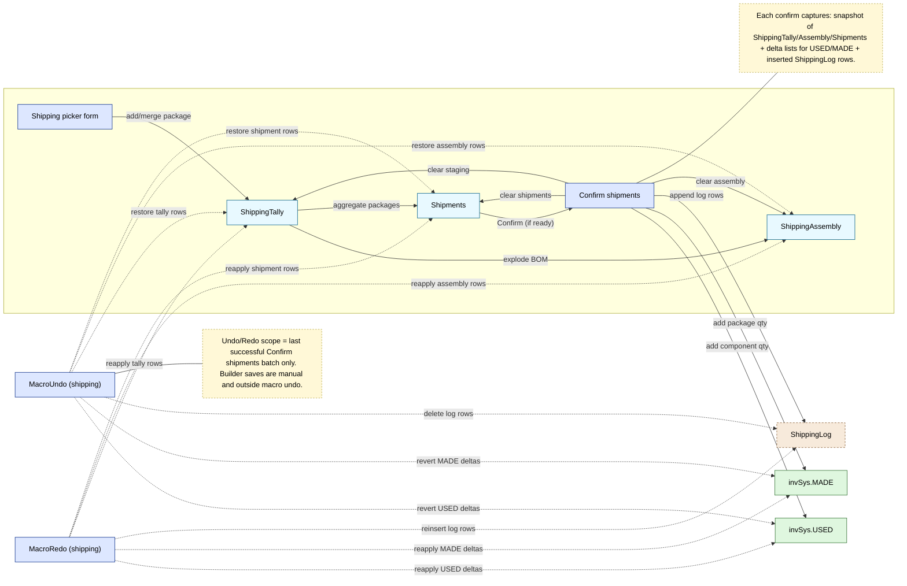

Undo / Redo Policy – Shipping
============================

```mermaid
flowchart LR
    classDef list fill:#e8f9ff,stroke:#2c7a9b,color:#000,stroke-width:1.2px;
    classDef data fill:#dff7df,stroke:#2f6f2f,color:#000;
    classDef log fill:#f7eadb,stroke:#8c6239,color:#000,stroke-dasharray:4 3;
    classDef button fill:#dde7ff,stroke:#2f4e9c,color:#000,stroke-width:1.2px;
    classDef note fill:#fff8d7,stroke:#b5a542,color:#000,stroke-dasharray:3 3;

    subgraph Entry[ ]
        direction LR
        PICKER["Shipping picker form"]:::button
        TALLY["ShippingTally"]:::list
        ASSY["ShippingAssembly"]:::list
        SHIP["Shipments"]:::list
        CNF["Confirm shipments"]:::button
    end

    INV_USED["invSys.USED"]:::data
    INV_MADE["invSys.MADE"]:::data
    SLOG["ShippingLog"]:::log

    UNDO["MacroUndo (shipping)"]:::button
    REDO["MacroRedo (shipping)"]:::button

    PICKER -->|add/merge package| TALLY -->|explode BOM| ASSY
    TALLY -->|aggregate packages| SHIP
    SHIP -->|"Confirm (if ready)"| CNF

    CNF -->|add component qty| INV_USED
    CNF -->|add package qty| INV_MADE
    CNF -->|append log rows| SLOG
    CNF -->|clear staging| TALLY
    CNF -->|clear assembly| ASSY
    CNF -->|clear shipments| SHIP

    UNDO -.->|restore tally rows| TALLY
    UNDO -.->|restore assembly rows| ASSY
    UNDO -.->|restore shipment rows| SHIP
    UNDO -.->|revert USED deltas| INV_USED
    UNDO -.->|revert MADE deltas| INV_MADE
    UNDO -.->|delete log rows| SLOG

    REDO -.->|reapply tally rows| TALLY
    REDO -.->|reapply assembly rows| ASSY
    REDO -.->|reapply shipment rows| SHIP
    REDO -.->|reapply USED deltas| INV_USED
    REDO -.->|reapply MADE deltas| INV_MADE
    REDO -.->|reinsert log rows| SLOG

    NOTE1["Undo/Redo scope = last successful Confirm shipments batch only. Builder saves are manual and outside macro undo."]:::note
    NOTE2["Each confirm captures: snapshot of ShippingTally/Assembly/Shipments + delta lists for USED/MADE + inserted ShippingLog rows."]:::note

    UNDO --- NOTE1
    CNF --- NOTE2
```
