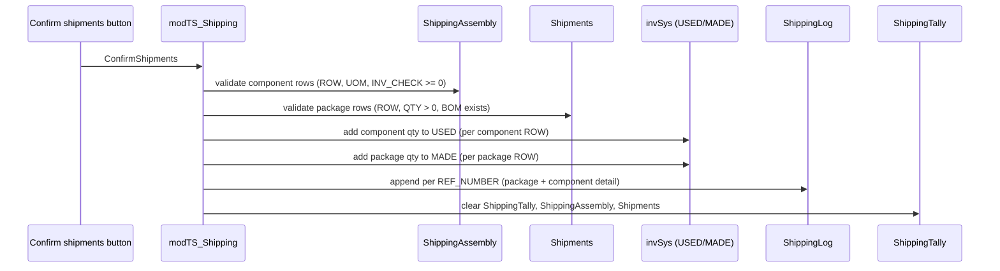

Shipping Confirm Writes – data and operations
============================================

The diagram details how Confirm shipments touches each header/column. Component consumption (USED) and package production (MADE) both happen in one pass.

```mermaid
flowchart TD
  %% Staging (per REF)
  subgraph STG["ShippingTally (staging)"]
    STG_REF["REF_NUMBER"]
    STG_ITEM["ITEMS (package)"]
    STG_QTY["QUANTITY"]
  end

  %% Aggregated packages
  subgraph SHIP["Shipments (package aggregate)"]
    SHIP_ROW["PACKAGE_ROW (invSys row of managed package)"]
    SHIP_ITEM["PACKAGE ITEM"]
    SHIP_QTY["PACKAGE QUANTITY (sum per ROW)"]
    SHIP_REF["REF_NUMBER display (concat)"]
    SHIP_LOC["LOCATION"]
  end

  %% Component explosion
  subgraph ASSY["ShippingAssembly (component aggregate)"]
    ASSY_ROW["COMPONENT ROW (invSys row)"]
    ASSY_ITEM["COMPONENT ITEM"]
    ASSY_QTY["NEEDED_QTY (sum per component ROW)"]
    ASSY_TOTAL["TOTAL_INV (from invSys)"]
    ASSY_CHECK["INV_CHECK = TOTAL_INV - NEEDED_QTY"]
    ASSY_UOM["UOM"]
    ASSY_LOC["LOCATION"]
  end

  %% Destination tables
  subgraph INVU["invSys.USED"]
    INV_ROW_U["ROW"]
    INV_USED["USED"]
  end

  subgraph INVM["invSys.MADE"]
    INV_ROW_M["ROW"]
    INV_MADE["MADE"]
  end

  subgraph LOG["ShippingLog"]
    LOG_REF["REF_NUMBER"]
    LOG_PKG["PACKAGE ITEM"]
    LOG_PKG_QTY["PACKAGE QUANTITY"]
    LOG_COMP["COMPONENT ITEM"]
    LOG_COMP_QTY["COMPONENT QUANTITY"]
    LOG_ROW["ROW (package/component)"]
    LOG_UOM["UOM"]
    LOG_LOC["LOCATION"]
    LOG_SNAP["SNAPSHOT_ID (NewGuid)"]
    LOG_DATE["ENTRY_DATE (Now)"]
  end

  %% Relationships
  STG_REF -->|concat| SHIP_REF
  STG_QTY -->|sum by package ROW| SHIP_QTY
  STG_QTY -->|explode via BOM\nsum per component ROW| ASSY_QTY
  SHIP_ROW --> INV_ROW_M
  SHIP_QTY -->|add to| INV_MADE
  ASSY_ROW --> INV_ROW_U
  ASSY_QTY -->|add to| INV_USED
  ASSY_CHECK -->|validate >= 0| ASSY_CHECK

  %% Logging
  STG_REF -->|copy| LOG_REF
  SHIP_ITEM -->|copy| LOG_PKG
  STG_QTY -->|copy| LOG_PKG_QTY
  ASSY_ITEM -->|copy| LOG_COMP
  ASSY_QTY -->|copy| LOG_COMP_QTY
  ASSY_UOM -->|copy| LOG_UOM
  ASSY_LOC -->|copy| LOG_LOC
  ASSY_ROW -->|copy| LOG_ROW
  LOG_SNAP -.generated.- LOG_SNAP
  LOG_DATE -.generated.- LOG_DATE

  %% Notes
  classDef note fill:#fff7c7,stroke:#d4b106,color:#222,font-size:11px;
  note1[[Shipments supplies package ROW/ITEM for MADE and logging.]]:::note
  note2[[ShippingAssembly drives USED deltas and ensures inventory sufficiency via INV_CHECK >= 0.]]:::note
  note3[[Log rows include both package- and component-level detail per REF_NUMBER.]]:::note

  note1 --- SHIP_ROW
  note2 --- ASSY_CHECK
  note3 --- LOG_COMP
```

## VBA call stack (simplified)

