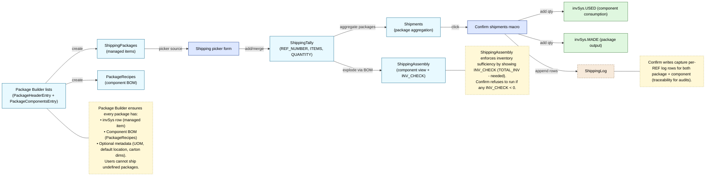

Shipping system proposal (Mermaid)
==================================

Goal: replace ad-hoc shipping macros with a structured, list-object-driven workflow that mirrors ReceivedTally but supports package BOMs and invSys managed items.

Key deltas vs. legacy
---------------------
1. **Managed packages** – packages exist as real invSys rows, making them searchable, countable, and ship-ready.
2. **BOM-aware tally** – ShippingAssembly automatically explodes BOMs using ShippingBOM so the operator never hand-calculates component usage.
3. **Inventory check before confirm** – INV_CHECK column highlights shortages immediately; confirm enforces sufficiency.
4. **Symmetric logging** – ShippingLog mirrors ReceivedLog but tracks both package (output) and component (input) deltas for reconciliation.
5. **Single-source macros** – All confirm/undo/redo logic lives in `modTS_Shipping`, giving parity with `modTS_Received`.
