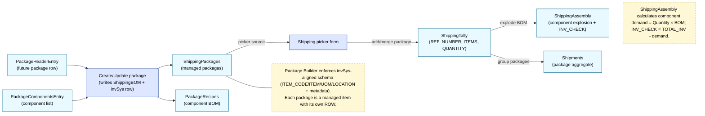
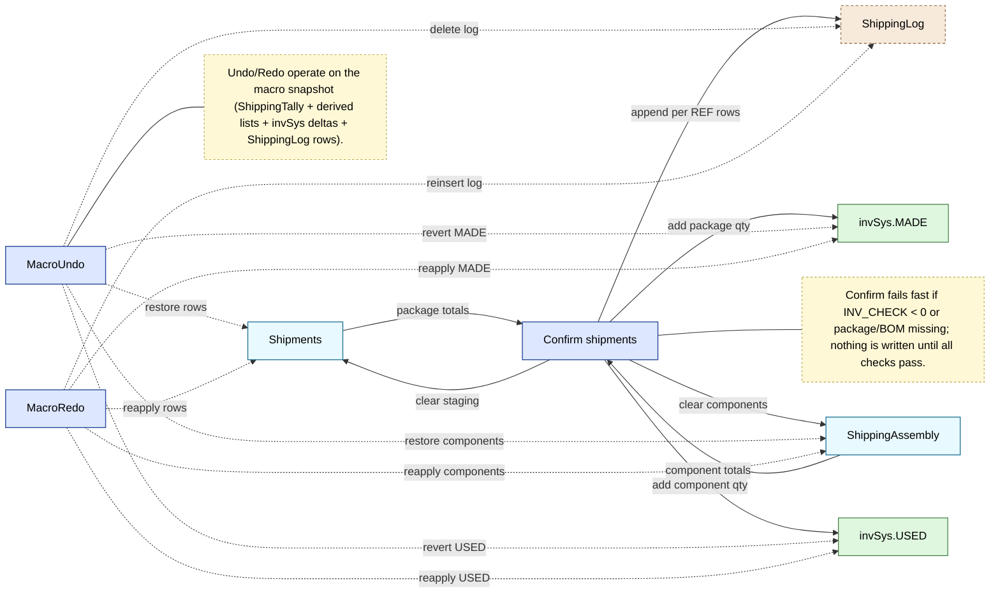

List-object-based shipping flow – Mermaid views
===============================================

This mirrors the received system diagrams but emphasizes package creation plus shipping tally.

View A – Package Builder + Shipping staging
-------------------------------------------

View B – Confirm / Undo / Redo / Logging
----------------------------------------

