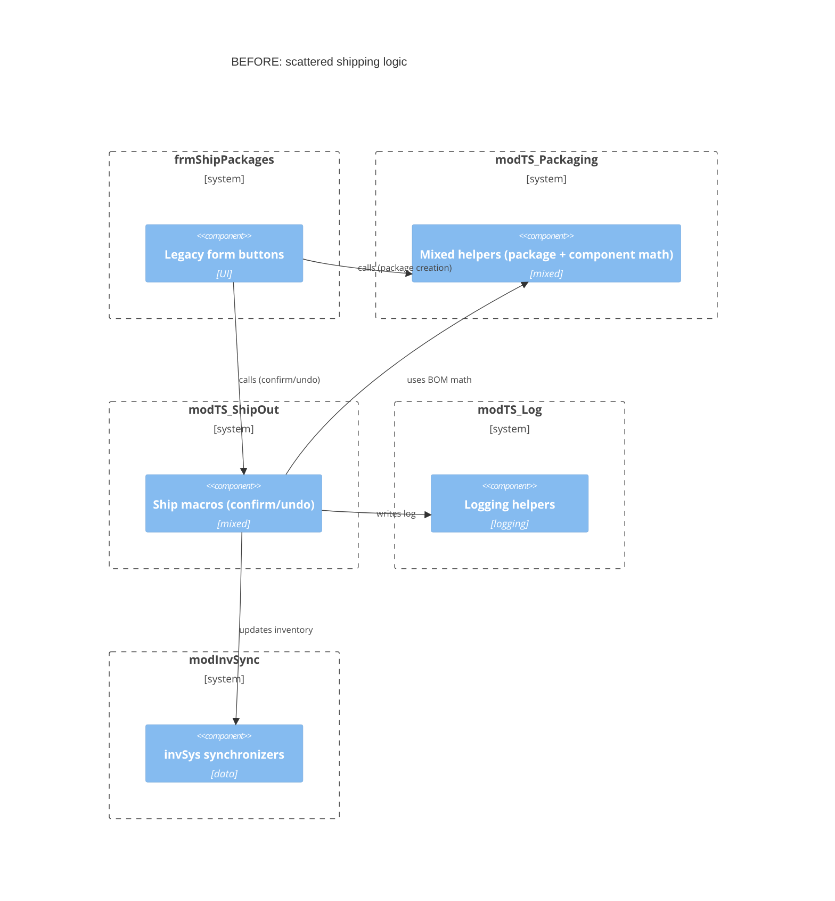
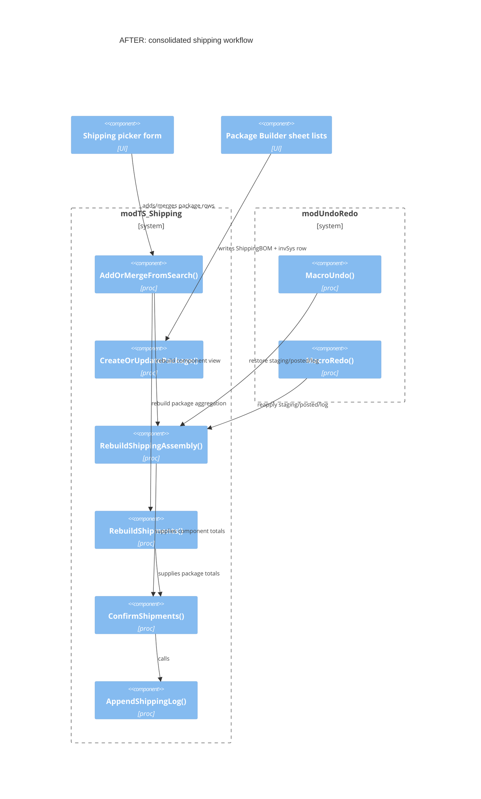
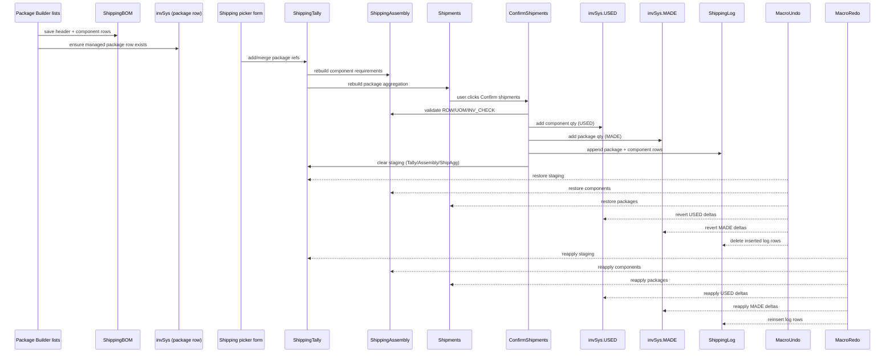
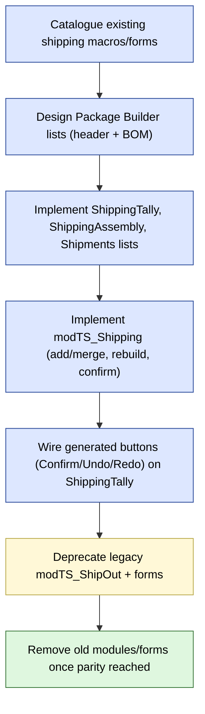

Refactor views – Shipping system
================================

View 1 – Module consolidation (Before + After)
----------------------------------------------

View 2 – Runtime sequence (builder + shipping confirm)
------------------------------------------------------

View 3 – Migration plan (flowchart)
-----------------------------------

