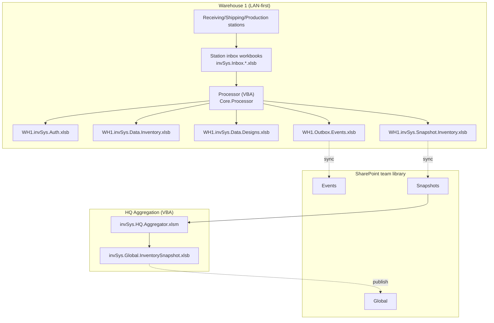
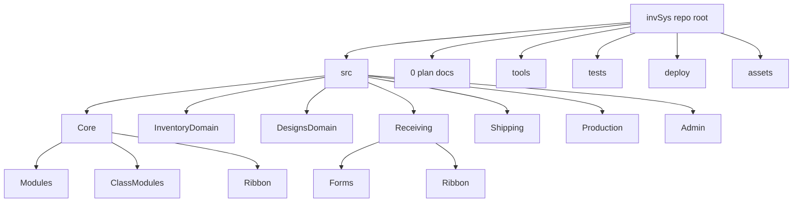
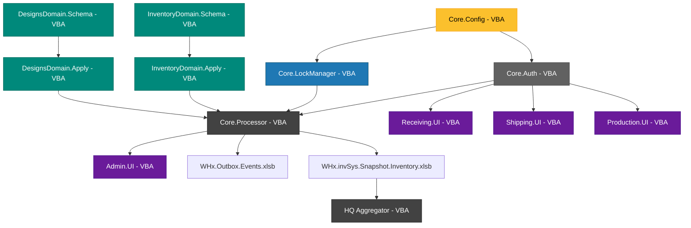
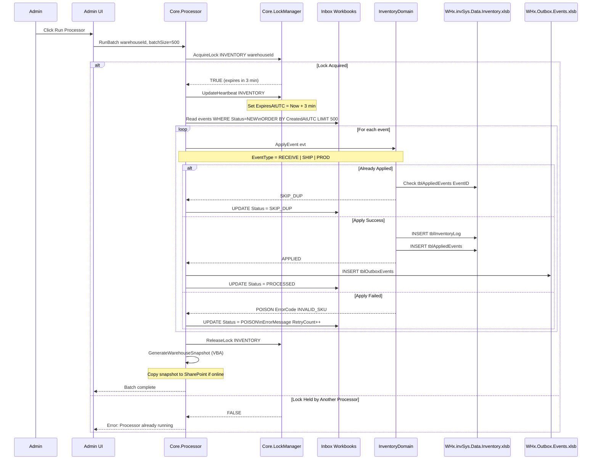

# invSys Architecture v4.41 - Release 1 Plan
**Project:** invSys Multi-Warehouse Inventory System  
**Version:** 4.41 (VBA Release 1)  
**Date:** March 9, 2026  
**Author:** Justin  
**Purpose:** Complete architectural specification for Release 1 (VBA/Excel only).

---
## Reference Links
- `https://www.perplexity.ai/search/https-github-com-soetrain-invs-IL_KZ22YSsW5kMph4kOzxA?preview=1#7`
- `https://www.perplexity.ai/search/this-is-my-retconned-plan-plan-1l63Rt2_SDSKyOklg90qdA#7`

---
## Release Strategy
### Release 1: VBA-Only Foundation (AUTHORITATIVE FOR SHIPPING)
**Scope:** Complete event-sourced inventory system implemented entirely in VBA/Excel.
- Core: Auth, Config, LockManager, Processor (VBA)
- Domain: InventoryDomain, DesignsDomain (VBA)
- Role UIs: Receiving, Shipping, Production (VBA + RibbonX)
- Admin: Console, processor orchestration (VBA)
- HQ: Aggregation via VBA macro (Excel-based)
- Distribution: SharePoint team document library
- Deployment: XLAM add-ins + workbooks

**No external dependencies:** R1 requires only Excel + SharePoint (no Python, .NET, or other runtimes).

---
## Progress Tracking (v4.41)
**Legend:** `[ ]` not started, `[x]` complete

### Release 1 Milestones
- [x] Phase 1 complete: Foundation
- [x] Phase 2 complete: Event Processing
- [ ] Phase 3 complete: Role UI
- [ ] Phase 4 complete: Admin Tooling
- [ ] Phase 5 complete: Multi-Warehouse Sync
- [ ] Phase 6 complete: Polish and Release

### Key Architecture Deliverables
- [ ] Core.ItemSearch module implemented (shared normalization/query/filter logic)
- [ ] Role-specific item search forms implemented (`ufReceivingItemSearch`, `ufShippingItemSearch`, `ufProductionItemSearch`, `ufAdminItemSearch`)
- [x] Processor idempotency verified with duplicate-event test
- [x] Schema self-heal validation verified across required workbooks

---
## Executive Summary
### Purpose
This document provides a single, coherent, Codex AI-ready specification for the invSys retcon project. It converts a legacy VBA inventory management application into a modern, event-sourced, multi-warehouse system. Release 1 is the only shippable specification.

### Key Architectural Principles
1. **Event Sourcing:** All domain state changes happen via inbox/outbox event streams.
2. **Offline-First:** Each warehouse operates autonomously on LAN; SharePoint is a convenience layer.
3. **Clear Boundaries:** Core (orchestration) / Domain (writes) / Role (UI) separation.
4. **Idempotent Processing:** Crash-safe, restart-safe event application.
5. **VBA-First:** R1 runtime is 100% VBA; external runtimes are out of scope.

### System Capabilities
- Multi-warehouse inventory tracking (receiving, shipping, production).
- Offline-capable operations with eventual consistency.
- Role-based access control with capability enforcement.
- Event-driven architecture with processor-based batch application.
- Self-healing table schemas with automatic migration.

### Technology Stack (Release 1)
**Core System:**
- **Platform:** Microsoft Excel 2016+ (Windows)
- **Language:** VBA (Visual Basic for Applications)
- **Persistence:** Excel workbooks (.xlsb, .xlsm, .xlam)
- **Distribution:** SharePoint Online document library (team library)
- **Scheduling:** Windows Task Scheduler (opens Excel, runs VBA macros)
- **Version Control:** Git (via VBA source export scripts)

**No runtime dependencies:** R1 requires only Excel + SharePoint.

---
## Architecture Decisions
### D1 -- One Write Model Everywhere: Inbox/Outbox + Processor
**Decision:** All domain state changes happen by **appending events** into an **inbox** (and/or publishing **outbox** events). A **processor** is the only component that applies events to authoritative data stores.

**Rationale:**
- Enforces single-writer pattern (processor only)
- Enables offline operation (append-only inboxes do not block)
- Provides audit trail and idempotency
- Crash-safe: unapplied events remain in inbox

**VBA Implementation Details:**
```text
RULE: Each station writes to its OWN inbox file (e.g., invSys.Inbox.Receiving.S1.xlsb).
Processor reads ALL station inboxes sequentially in a single warehouse run.
This avoids VBA file-locking conflicts when multiple stations append simultaneously.
```

**SharePoint Sync Strategy:**
```text
RULE: Outbox files are written atomically to local disk, then copied to SharePoint
team library when online. HQ Aggregator copies outbox files to a local temp
folder before reading to avoid corruption from incomplete syncs.
```

---
### D2 -- Multi-Warehouse, LAN-First, SharePoint as Convenience Layer
**Decision:** Each warehouse has **local authoritative Excel workbooks** (inventory and optionally designs) and can operate when internet is down. Warehouses **publish outbox workbooks** (and periodic snapshot workbooks) to a **SharePoint team document library** when online. HQ aggregates events and produces a **global snapshot workbook** for cross-warehouse visibility.

**Conflict Resolution:**
```text
RULE: Global snapshot aggregation is last-write-wins by AppliedAtUTC. Conflicts
are logged but not blocked. Each warehouse's authoritative store remains
independent; global snapshot is advisory only for cross-warehouse visibility.

Example: If WH1 and WH2 both receive SKU-123 at 10:05 AM, HQ snapshot shows both
transactions with their respective AppliedAtUTC timestamps. No merge/
reconciliation is performed.
```

**Consistency Model:**
- **Warehouse-local:** Strongly consistent (single processor per warehouse)
- **Cross-warehouse:** Eventually consistent (via periodic sync)
- **Global snapshot:** Point-in-time consistent (rebuilt from warehouse snapshots)

---
### D3 -- Clear Ownership Boundaries
**Decision:**
- **Core:** Authorization gate, orchestration, config, lock manager, processor runner, shared utilities
- **Domain XLAMs:** All writes to authoritative data stores + domain invariants
- **Role XLAMs:** UI + event creation only
- **Admin XLAM:** Orchestration console only (invokes Core + domain routines; does not write domain tables directly)

**Clarification on Domain Reads:**
```text
RULE: Domain XLAMs expose READ-ONLY query functions (e.g., GetOnHandQty, GetBOM,
ListDesigns). Admin XLAM and Role XLAMs may call these for UI display. WRITE
operations go through Core.Orchestrate only.

Example:
- OK: Admin calls InventoryDomain.GetOnHandQty(SKU) to display current inventory
- NO: Admin directly writes to tblInventoryLog (forbidden)
- OK: Admin calls Core.Orchestrate("ADJUST_INVENTORY", payload) (creates event in inbox)
```

---
### D4 -- Forms Strategy (Role-Specific UI + Shared Core)
**Decision:** Each role add-in implements role-specific search forms optimized for that workflow (`ufReceivingItemSearch`, `ufShippingItemSearch`, `ufProductionItemSearch`, `ufAdminItemSearch`). Shared search logic lives in `Core.ItemSearch` so bug fixes propagate from one code path without form-copy synchronization.

**Rationale:** Receiving, Shipping, Production, and Admin need different search priorities and defaults (vendor/PO focus vs available-to-pick focus vs BOM/WIP focus vs full diagnostics). A mechanical form sync flow assumes uniform forms and does not hold once role UI diverges.

**Implementation Rules:**
```text
RULE: Core.ItemSearch contains:
  - Search normalization (trim, case normalization, synonym mapping)
  - Index query logic for tblItemSearchIndex (Scripting.Dictionary lookups)
  - Role-aware filtering (for example: RECEIVING includes expected receipts,
    SHIPPING defaults to available inventory, PRODUCTION includes BOM links/WIP)

RULE: Each role XLAM contains:
  - Its own item-search userform (role-specific name and layout)
  - Role-specific grid columns and default filters
  - UI-only behavior and event wiring; business search rules stay in Core.ItemSearch
```

**Form Ownership Matrix:**
| Component | Receiving | Shipping | Production | Admin |
|---|---|---|---|---|
| `Core.ItemSearch` (module) | Shared | Shared | Shared | Shared |
| `ufReceivingItemSearch` | Owns | No | No | No |
| `ufShippingItemSearch` | No | Owns | No | No |
| `ufProductionItemSearch` | No | No | Owns | No |
| `ufAdminItemSearch` | No | No | No | Owns |
| `ufDynDesignSearchTemplate` | No | No | Copy | Copy |
| `ufDynAdminTemplate` | No | No | No | Admin only |

---
### D5 -- Core.Config Contract (R1 Locked)
**Decision:** `WHx.invSys.Config.xlsb` is the single authoritative config source in R1 (no workbook-local overrides).

**Rules:**
- Precedence is fixed: `tblStationConfig` -> `tblWarehouseConfig` -> hardcoded defaults.
- Config is strongly typed and schema-validated at load; required missing keys fail validation.
- `Core.Config` is read-only in R1 with explicit `Load`/`Reload` support.
- Missing optional keys use defaults and log warnings.
- Missing required keys or missing workbook fails closed for write operations.

**Public API Contract:**
- `Load(Optional whId, Optional stId) As Boolean`
- `Get(key) As Variant`
- `GetRequired(key) As Variant`
- `TryGet(key, ByRef outVal) As Boolean`
- `Reload() As Boolean`
- `Validate() As String`
- `GetWarehouseId() As String`, `GetStationId() As String`

---
### D6 -- Locking Runtime Rules (R1 Locked)
**Decision:** Processor lock behavior is standardized across warehouses.

**Rules:**
- Lock order is always `INVENTORY` then `DESIGNS` (only when required).
- Heartbeat updates every 30 seconds while lock is held.
- `ExpiresAtUTC` is `Now + 3 minutes`, extended on heartbeat.
- If batch lock hold exceeds 2 minutes, log warning and tune batch size.
- Break-lock requires `ADMIN_MAINT` and an audit reason.

---
### D7 -- Poison Handling and Reissue (R1 Locked)
**Decision:** Poison rows are immutable audit history.

**Rules:**
- Failed rows are marked `POISON` with `ErrorCode`, `ErrorMessage`, `RetryCount`, `FailedAtUTC`.
- Admin reissue creates a new event row with a new `EventID`.
- Reissue links with `ParentEventId = <original EventID>`.
- Original poison row is never edited back to `NEW`.

---
### D8 -- Capability Enforcement and Audit (R1 Locked)
**Decision:** Core is the sole authorization authority for posting and processor actions.

**Rules:**
- Role UI gating is advisory; Core gate is authoritative.
- Gate decisions log: request/event id, user, capability, warehouse, station, result, timestamp, source.
- Capability cache uses TTL; if cache expires and cannot refresh, write operations fail closed.
- If TTL expires mid-processor-run, finish current run with current cache and refresh before next run.

---
## System Topology (Release 1: VBA-Only)

**Note:** Warehouses 2..N follow the same pattern as Warehouse 1.

---
## HQ Aggregation (Release 1)
**Purpose:** Provide cross-warehouse visibility by consolidating published warehouse snapshots into a global snapshot workbook.
**Implementation:** Excel workbook `invSys.HQ.Aggregator.xlsm` with VBA modules.
**Inputs:** `WHx.invSys.Snapshot.Inventory.xlsb` (and designs snapshot if enabled) from the SharePoint team document library.
**Output:** `invSys.Global.InventorySnapshot.xlsb` (read-only, for reporting).
**Execution:** Admin XLAM command or Windows Task Scheduler / `Application.OnTime` runs `RunHQAggregation` inside Excel.
**Safety:** Copy each snapshot to a local temp folder before opening to avoid partial-sync reads.
**Limitations:** Single-threaded VBA; runtime scales with number of warehouses and rows.

**VBA Outline:**
```vba
Sub RunHQAggregation()
    Dim whIds() As String
    whIds = LoadWarehouseIds()
    ClearGlobalSnapshot
    Dim whId As Variant
    For Each whId In whIds
        AppendWarehouseSnapshot CStr(whId)
    Next
    SaveGlobalSnapshot
End Sub
```

---
## Backup and Restore (Release 1)
**Goal:** Simple, reliable copies of critical workbooks using VBA and SharePoint storage.
**Backed up workbooks:** `WHx.invSys.Auth.xlsb`, `WHx.invSys.Config.xlsb`, `WHx.invSys.Data.Inventory.xlsb`, `WHx.invSys.Data.Designs.xlsb` (if enabled), `WHx.invSys.Snapshot.*.xlsb`.
**Method:** `Workbook.SaveCopyAs` to a timestamped folder in the SharePoint team document library (e.g., `/Backups/WH1/2026-02-03/`).
**Cadence:** Daily (or per shift) via Admin XLAM or Task Scheduler.

**Restore playbook:**
1. Close Excel and remove the damaged workbook.
2. Copy the latest backup into the warehouse root.
3. Open the workbook; on-open schema self-heal recreates missing tables/columns.
4. Run processor in validate-only mode; then resume normal processing.

**R1 requirement:** Workbooks must auto-regenerate required tables/columns on open so users can recover after accidental deletions.

---
## Schema Validation (Release 1)
**Goal:** Ensure required tables/columns exist and self-heal on open.
**Mechanism:** VBA schema manifest per workbook (stored in Config or embedded in domain XLAM) describing required tables, columns, types, and defaults.
**When:** On workbook open and before processor apply.

**Rules:**
- Missing tables/columns are recreated with defaults.
- Extra columns are preserved but not relied upon by the system.
- Required headers are color-coded and locked to prevent edits.

---
## Item Search (Release 1)
**Goal:** Fast, local search without external services.
**Strategy:** Build a cached index table (e.g., `tblItemSearchIndex`) from Inventory and Designs data at open and after processor apply. Load into a `Scripting.Dictionary` for instant lookup. Put normalization, index query, and role filtering in `Core.ItemSearch`.
**UI:** Each role XLAM uses a role-specific item-search form (`ufReceivingItemSearch`, `ufShippingItemSearch`, `ufProductionItemSearch`, `ufAdminItemSearch`) and role-specific columns/default filters. Search keys remain normalized (SKU, name, alt codes).
**Performance:** Target sub-second results for thousands of rows on standard warehouse PCs.

---
## Monitoring and Alerts (Release 1)
**Goal:** Provide operational visibility using Excel-native tools.
**Dashboard:** Admin XLAM shows processor status, inbox backlog counts, last run timestamps, last error, lock status, and outbox sync health.
**Logging:** Append to log tables in the admin console workbook or a dedicated log sheet in warehouse data workbooks.
**Alerts:** Optional VBA email via Outlook (if available) for failures/threshold breaches; otherwise log-only.

---
## SharePoint Folder Structure

```mermaid
flowchart TB
  ROOT["SharePoint: /invSys"]
  ROOT --> ADDINS[Addins]
  ROOT --> EVENTS[Events]
  ROOT --> SNAP[Snapshots]
  ROOT --> GLOBAL[Global]
  ROOT --> CONFIG[Config]
  ROOT --> AUTH[Auth]
  ROOT --> BACKUPS[Backups]
  ROOT --> DOCS[Docs]

  ADDINS --> ADDINSCURRENT[Current]
  ADDINS --> ADDINSARCHIVE[Archive]
  ADDINSCURRENT --> XLAMCORE[invSys.Core.xlam]
  ADDINSCURRENT --> XLAMINV[invSys.Inventory.Domain.xlam]
  ADDINSCURRENT --> XLAMDES[invSys.Designs.Domain.xlam]
  ADDINSCURRENT --> XLAMRECV[invSys.Receiving.xlam]
  ADDINSCURRENT --> XLAMSHIP[invSys.Shipping.xlam]
  ADDINSCURRENT --> XLAMPROD[invSys.Production.xlam]
  ADDINSCURRENT --> XLAMADMIN[invSys.Admin.xlam]

  EVENTS --> EWH1[WH1.Outbox.Events.xlsb]
  EVENTS --> EWH2[WH2.Outbox.Events.xlsb]
  SNAP --> SWH1[WH1.invSys.Snapshot.Inventory.xlsb]
  SNAP --> SWH2[WH2.invSys.Snapshot.Inventory.xlsb]
  GLOBAL --> GINV[invSys.Global.InventorySnapshot.xlsb]
  GLOBAL --> GDES[invSys.Global.DesignsSnapshot.xlsb]
  CONFIG --> CWH1[WH1.invSys.Config.xlsb]
  AUTH --> AWH1[WH1.invSys.Auth.xlsb]
  BACKUPS --> BWH1[WH1/2026-02-03/...]
```

**Note:** Inbox workbooks live on local station PCs and are not stored in SharePoint.

---
## Repository Structure

**Tools (R1):** `export-vba.ps1`, `build-xlam.ps1`.

---
## Component Dependency Graph


---
## Workflows and Sequences
### Workflow 1: Warehouse Processor Batch Application (VBA - Release 1)


---
## Development Roadmap (Release 1: VBA-Only)
### Phase 1: Foundation
**Goal:** Core infrastructure + basic domain schemas

**Tasks:**
- [x] Set up repository structure
- [x] Build Core.Config module
- [x] Build Core.Auth module (workbook-based, PIN deferred to Phase 2)
- [x] Build InventoryDomain.Schema with self-repair
- [x] Create sample `WH1.invSys.Auth.xlsb` and `WH1.invSys.Config.xlsb` workbooks

**Tests:**
- [x] Test: Core.Config precedence resolves `Station -> Warehouse -> Default` and required keys fail closed
- [x] Test: Core.Auth capability check returns ALLOW/DENY for scoped warehouse/station cases
- [x] Test: Inventory schema self-heal recreates missing required table/column definitions

**Deliverables:**
- [x] Core and InventoryDomain XLAMs load config and validate schemas

**Execution Evidence:** `tests/unit/phase1_test_results.md` (14 passed, 0 failed on 2026-03-08)

---
### Phase 2: Event Processing
**Goal:** Processor + domain event application for Receiving, Shipping, and Production

**Spec correction(3/8/26):** Phase 2 scope includes processor/domain handling for `RECEIVE`, `SHIP`, and `PROD`. The execution evidence currently recorded below reflects the implemented receive-path validation from the completed phase 2 workstream; shipping/production parity remains a follow-up implementation gap against the corrected scope definition.

**Tasks:**
- [x] Build Core.LockManager module
- [x] Build Core.Processor batch loop
- [x] Build InventoryDomain.Apply (Receive events)
- [ ] Build InventoryDomain.Apply (Shipping events)
- [ ] Build InventoryDomain.Apply (Production events)
- [x] Create sample `invSys.Inbox.Receiving.S1.xlsb` workbook
- [ ] Create sample `invSys.Inbox.Shipping.S1.xlsb` workbook
- [ ] Create sample `invSys.Inbox.Production.S1.xlsb` workbook
- [x] Create sample `WH1.invSys.Data.Inventory.xlsb` workbook

**Tests:**
- [x] Test: AcquireLock/ReleaseLock + heartbeat lifecycle (`30s heartbeat`, `3 min expiry`)
- [x] Test: Receiving inbox row -> Run processor -> row appears in `tblInventoryLog` and `tblAppliedEvents`
- [x] Test: Duplicate EventID is marked `SKIP_DUP` and does not create duplicate inventory rows
- [ ] Test: Shipping inbox row -> Run processor -> row appears in `tblInventoryLog` and `tblAppliedEvents`
- [ ] Test: Production inbox row -> Run processor -> row appears in `tblInventoryLog` and `tblAppliedEvents`

**Deliverables:**
- [ ] Working end-to-end event processing for Receiving, Shipping, and Production

**Execution Evidence:** `tests/unit/phase2_test_results.md` (21 passed, 0 failed on 2026-03-09)

---
### Phase 3: Role UI
**Goal:** Receiving, Shipping, Production UIs

**Tasks:**
- [ ] Build RibbonX XML for all role XLAMs
- [ ] Build Receiving.UI + EventCreator
- [ ] Build Shipping.UI + EventCreator
- [ ] Build Production.UI + EventCreator
- [ ] Build role-specific item search forms for each role XLAM

**Tests:**
- [ ] Test: Role buttons are disabled/hidden when required capability is missing
- [ ] Test: Each role UI writes valid inbox events with required fields and normalized values
- [ ] Test: UI -> Create events -> Process -> Verify domain logs for receiving/shipping/production

**Deliverables:**
- [ ] All role XLAMs functional with Ribbon controls

---
### Phase 4: Admin Tooling
**Goal:** Admin XLAM with orchestration console

**Tasks:**
- [ ] Build Admin.UI main panel
- [ ] Build break-lock functionality
- [ ] Build poison queue viewer
- [ ] Build manual reissue workflow
- [ ] Build snapshot generation button

**Tests:**
- [ ] Test: Break-lock requires `ADMIN_MAINT` and writes audit reason/timestamp
- [ ] Test: Reissue from poison creates new `EventID` with `ParentEventId` link to original row
- [ ] Test: Admin run + reissue + rerun completes without duplicate apply side effects

**Deliverables:**
- [ ] Admin XLAM with full management capabilities

---
### Phase 5: Multi-Warehouse Sync
**Goal:** Outbox, VBA HQ aggregation, global snapshots

**Tasks:**
- [ ] Build Outbox event writing in Processor (VBA)
- [ ] Build VBA HQ aggregation macro (`invSys.HQ.Aggregator.xlsm`)
- [ ] Build global snapshot generation logic (VBA)
- [ ] Configure Windows Task Scheduler for HQ aggregation

**Tests:**
- [ ] Test: Outbox writes include applied metadata (`EventID`, `AppliedAtUTC`, `RunId`, source warehouse/station)
- [ ] Test: SharePoint sync workflow (manual file copy simulation) publishes warehouse snapshots/events correctly
- [ ] Test: WH1 + WH2 -> HQ aggregation -> Global snapshot preserves per-warehouse quantities

**Deliverables:**
- [ ] Multi-warehouse sync with VBA-powered HQ Aggregator

---
### Phase 6: Polish and Release
**Goal:** Reliability hardening and production readiness

**Tasks:**
- [ ] Finalize error handling, logging, and operator documentation
- [ ] Build and run full regression test suite
- [ ] Execute production pilot with 1 warehouse

**Tests:**
- [ ] Test: Regression suite passes happy-path, duplicate-event, poison-reissue, and lock-contention scenarios
- [ ] Test: Backup/restore drill validates recovery playbook and schema self-heal on reopen
- [ ] Test: Pilot run meets baseline throughput and stability targets for one full shift

**Deliverables:**
- [ ] Release 1.0 ready for production

## Testing Strategy (Release 1: VBA)
### Unit Tests (VBA)
**Framework:** Manual VBA test harness

**Test Harness Pattern:**
```vba
' MODULE: TestRunner.bas in TestHarness.xlsm
Sub RunAllTests()
    Dim passed As Long, failed As Long

    ' Core.Auth tests
    passed = passed + TestCanPerform_UserHasCapability()
    passed = passed + TestCanPerform_UserLacksCapability()

    ' Core.LockManager tests
    passed = passed + TestAcquireLock_NotHeld()
    passed = passed + TestAcquireLock_AlreadyHeld()

    ' InventoryDomain.Apply tests
    passed = passed + TestApplyReceive_ValidEvent()
    passed = passed + TestApplyReceive_InvalidSKU()
    passed = passed + TestApplyReceive_Duplicate()

    Debug.Print "Tests passed: " & passed
    Debug.Print "Tests failed: " & failed
End Sub

Function TestCanPerform_UserHasCapability() As Long
    ' Setup: User1 has RECEIVE_POST for WH1
    Dim result As Boolean
    result = Core.Auth.CanPerform("RECEIVE_POST", "user1", "WH1")

    If result = True Then
        Debug.Print "OK TestCanPerform_UserHasCapability PASSED"
        TestCanPerform_UserHasCapability = 1
    Else
        Debug.Print "FAIL TestCanPerform_UserHasCapability FAILED"
        TestCanPerform_UserHasCapability = 0
    End If
End Function
```

**Test Coverage:**
| Module | Function | Test Case | Expected Result | Status |
|---|---|---|---|---|
| Core.Auth | CanPerform("RECEIVE_POST", "user1", "WH1") | User1 has RECEIVE_POST for WH1 | TRUE | [ ] |
| Core.Auth | CanPerform("SHIP_POST", "user2", "WH1") | User2 does NOT have SHIP_POST | FALSE | [ ] |
| Core.LockManager | AcquireLock("INVENTORY", "WH1") | Lock not held | Returns TRUE, lock row created | [ ] |
| Core.LockManager | AcquireLock("INVENTORY", "WH1") | Lock already held by S1 | Returns FALSE, error message | [ ] |
| InventoryDomain | ApplyReceiveEvent(evt) | Valid event, SKU exists | Row in tblInventoryLog, event marked APPLIED | [ ] |
| InventoryDomain | ApplyReceiveEvent(evt) | Invalid SKU | Event marked POISON, error logged | [ ] |

---
### Integration Tests (VBA)
**Test Scenarios:**

**Test 1: Happy Path (Receive -> Process -> Snapshot)**
**Steps:**
1. User logs in to Receiving station
2. Adds 5 items to receive
3. Clicks "Confirm Writes"
4. Admin runs processor
5. Verify: 5 rows in tblInventoryLog, 5 rows in tblAppliedEvents
6. Admin generates snapshot
7. Verify: Snapshot shows updated QtyOnHand

**Expected Duration:** 5 minutes

---
**Test 2: Duplicate Event (Idempotency)**
**Steps:**
1. Manually copy an applied event row back to inbox (Status=NEW)
2. Admin runs processor
3. Verify: Event marked SKIP_DUP, no duplicate inventory log entry

**Expected Duration:** 2 minutes

---
**Test 3: Poison Row Recovery**
**Steps:**
1. Insert event with invalid SKU
2. Admin runs processor
3. Verify: Event marked POISON, error message captured
4. Admin reissues with corrected SKU
5. Admin runs processor
6. Verify: New event applied successfully

**Expected Duration:** 5 minutes

---
**Test 4: Multi-Warehouse (Cross-Warehouse Snapshot)**
**Steps:**
1. WH1 receives 100 units of SKU-001
2. WH2 receives 50 units of SKU-001
3. Both warehouses run processor
4. Both warehouses copy snapshots to SharePoint (manual simulation)
5. HQ Aggregator runs (VBA macro)
6. Verify `invSys.Global.InventorySnapshot.xlsb` shows WH1: SKU-001 = 100 and WH2: SKU-001 = 50.

**Expected Duration:** 10 minutes

---
## Error Recovery Playbooks
### Scenario 1: Processor Crashes Mid-Batch
**Symptoms:** Lock held, some events marked PROCESSED, some still NEW

**Recovery Steps:**
1. Admin opens Admin XLAM
2. Click "Break Lock" for affected warehouse
3. Enter reason: "Processor crash recovery"
4. Click "Run Processor" again
5. Processor skips already-applied events (idempotent)
6. Verify no duplicate inventory log entries

---
### Scenario 2: Inbox Workbook Corrupted
**Symptoms:** "File is corrupted and cannot be opened"

**Recovery Steps:**
1. Close all Excel instances
2. Restore last backup: `C:\\invSys\\Backups\\WHx\\invSys.Inbox.Receiving.S1_YYYYMMDD.xlsb`
3. Re-enter any events created after backup timestamp (manual data entry)
4. Mark corrupted file with `.CORRUPT` suffix
5. Log incident in Admin audit log

---
### Scenario 3: SharePoint Sync Conflict
**Symptoms:** "This file has been modified by another user"

**Recovery Steps:**
1. Close Excel
2. Open SharePoint library in web browser
3. Check file version history for `WHx.Outbox.Events.xlsb`
4. Download latest version to local temp folder
5. Use HQ Aggregator (VBA) to reprocess from local copy
6. Manually resolve conflicted copy if needed
7. Restart the SharePoint sync client if using sync

---
## Schema Appendix
### Inbox Tables (Release 1)
**Workbook:** `invSys.Inbox.Receiving.S1.xlsb`

**tblInboxReceive:**
```text
EventID        (text, PK)
ParentEventId  (text, optional)
UndoOfEventId  (text, optional)
CreatedAtUTC   (datetime)
WarehouseId    (text)
StationId      (text)
UserId         (text)
SKU            (text)
Qty            (number)
Location       (text)
Note           (text, optional)
Status         (text)   NEW | PROCESSED | SKIP_DUP | POISON
RetryCount     (number)
ErrorCode      (text, optional)
ErrorMessage   (text, optional)
FailedAtUTC    (datetime, optional)
```

---
### Inventory Domain Tables (Release 1)
**Workbook:** `WHx.invSys.Data.Inventory.xlsb`

**tblInventoryLog:**
```text
EventID        (text, PK)
UndoOfEventId  (text, optional)
AppliedSeq     (number)  global apply order
EventType      (text)
OccurredAtUTC  (datetime)
AppliedAtUTC   (datetime)
WarehouseId    (text)
StationId      (text)
UserId         (text)
SKU            (text)
QtyDelta       (number)
Location       (text)
Note           (text, optional)
```

**tblAppliedEvents:**
```text
EventID        (text, PK)
UndoOfEventId  (text, optional)
AppliedSeq     (number)  global apply order
AppliedAtUTC   (datetime)
RunId          (text)
SourceInbox    (text)
Status         (text)   APPLIED | SKIP_DUP
```

---
### Auth Tables (Release 1)
**Workbook:** `WHx.invSys.Auth.xlsb`

**tblUsers:**
```text
UserId         (text, PK)
DisplayName    (text)
PinHash        (text)
# R1: store PIN as hash or plaintext (TBD)
Status         (text)   Active | Disabled
ValidFrom      (date, optional)
ValidTo        (date, optional)
```

**tblCapabilities:**
```text
UserId        (text)
Capability    (text)
WarehouseId   (text)   WH1 or *
StationId     (text)   S1 or *
Status        (text)   Active | Disabled
ValidFrom     (date, optional)
ValidTo       (date, optional)
```

### Config Tables (Release 1)
**Workbook:** `WHx.invSys.Config.xlsb`

**tblWarehouseConfig:**
```text
WarehouseId              (text, PK)
WarehouseName            (text)
Timezone                 (text)
DefaultLocation          (text)
BatchSize                (number)
LockTimeoutMinutes       (number)
HeartbeatIntervalSeconds (number)
MaxLockHoldMinutes       (number)
SnapshotCadence          (text)
BackupCadence            (text)
PathDataRoot             (text)
PathBackupRoot           (text)
PathSharePointRoot       (text)
DesignsEnabled           (boolean)
PoisonRetryMax           (number)
AuthCacheTTLSeconds      (number)
```

**tblStationConfig:**
```text
StationId     (text, PK)
WarehouseId   (text)
StationName   (text)
RoleDefault   (text)   RECEIVE | SHIP | PROD | ADMIN
```

---

## Appendix: Carried Forward from Archived v2 Docs
### Config MVP Keys (R1 baseline)
- Warehouse scope: `WarehouseId`, `WarehouseName`, `Timezone`, `DefaultLocation`, `BatchSize`, `LockTimeoutMinutes`, `HeartbeatIntervalSeconds`, `MaxLockHoldMinutes`, `SnapshotCadence`, `BackupCadence`, `PathDataRoot`, `PathBackupRoot`, `PathSharePointRoot`, `DesignsEnabled`, `PoisonRetryMax`, `AuthCacheTTLSeconds`
- Station scope: `StationId`, `StationName`, `RoleDefault`
- Feature flags: `FF_DesignsEnabled`, `FF_OutlookAlerts`, `FF_AutoSnapshot`

### Outbox Table (Release 1)
**Workbook:** `WHx.Outbox.Events.xlsb`

**tblOutboxEvents:**
```text
EventID        (text, PK)
UndoOfEventId  (text, optional)
EventType      (text)   RECEIVE | SHIP | PROD | UNDO
WarehouseId    (text)
StationId      (text)
OccurredAtUTC  (datetime)
AppliedAtUTC   (datetime)
AppliedByUserId (text)
RunId          (text)
DeltaJson      (text)   minimal delta payload (no before/after)
```

### Additional Inbox Tables (Release 1)
**Workbook:** `invSys.Inbox.Shipping.S1.xlsb`

**tblInboxShip:**
```text
EventID        (text, PK)
ParentEventId  (text, optional)
UndoOfEventId  (text, optional)
CreatedAtUTC   (datetime)
WarehouseId    (text)
StationId      (text)
UserId         (text)
SKU            (text)
Qty            (number)
Location       (text)
Destination    (text, optional)
Note           (text, optional)
Status         (text)   NEW | PROCESSED | SKIP_DUP | POISON
RetryCount     (number)
ErrorCode      (text, optional)
ErrorMessage   (text, optional)
FailedAtUTC    (datetime, optional)
```

**Workbook:** `invSys.Inbox.Production.S1.xlsb`

**tblInboxProd:**
```text
EventID        (text, PK)
ParentEventId  (text, optional)
UndoOfEventId  (text, optional)
CreatedAtUTC   (datetime)
WarehouseId    (text)
StationId      (text)
UserId         (text)
DesignId       (text)
DesignVersion  (text)
QtyPlanned     (number)
Location       (text, optional)
Note           (text, optional)
Status         (text)   NEW | PROCESSED | SKIP_DUP | POISON
RetryCount     (number)
ErrorCode      (text, optional)
ErrorMessage   (text, optional)
FailedAtUTC    (datetime, optional)
```

### Lock Table (Release 1)
**Workbook:** `WHx.invSys.Data.Inventory.xlsb` and `WHx.invSys.Data.Designs.xlsb`

**tblLocks:**
```text
LockName       (text, PK)   INVENTORY | DESIGNS
OwnerStationId (text)
OwnerUserId    (text)
RunId          (text)
AcquiredAtUTC  (datetime)
ExpiresAtUTC   (datetime)
HeartbeatAtUTC (datetime)
Status         (text)       HELD | EXPIRED | BROKEN
```

---
