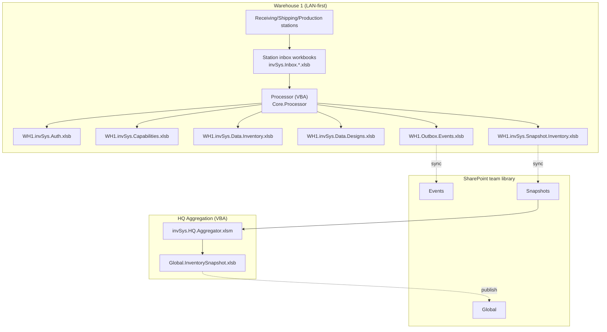
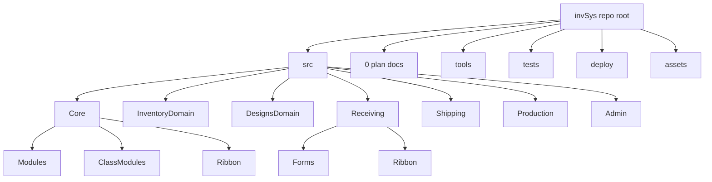
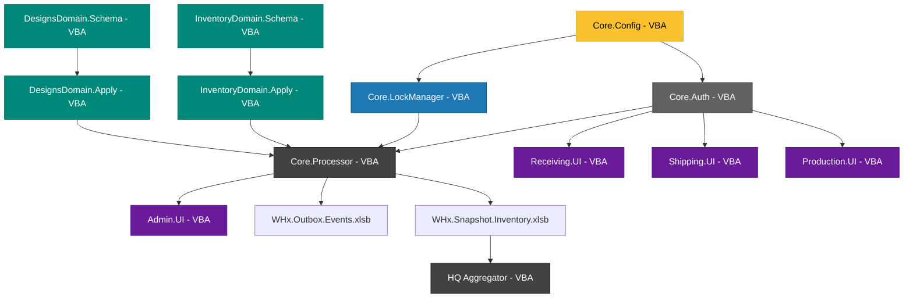

# invSys Architecture v4.0 - Release 1 Plan
**Project:** invSys Multi-Warehouse Inventory System  
**Version:** 4.0 (VBA Release 1)  
**Date:** February 3, 2026  
**Author:** Justin  
**Purpose:** Complete architectural specification for Release 1 (VBA/Excel only).

---
## Release Strategy
### Release 1: VBA-Only Foundation (AUTHORITATIVE FOR SHIPPING)
**Scope:** Complete event-sourced inventory system implemented entirely in VBA/Excel.
- Core: Auth, Config, LockManager, Processor (VBA)
- Domain: InventoryDomain, DesignsDomain (VBA)
- Role UIs: Receiving, Shipping, Production (VBA + RibbonX)
- Admin: Console, processor orchestration (VBA)
- HQ: Aggregation via VBA macro (Excel-based)
- Distribution: SharePoint team document library
- Deployment: XLAM add-ins + workbooks
**No external dependencies:** R1 requires only Excel + SharePoint (no Python, .NET, or other runtimes).

---
## Executive Summary
### Purpose
This document provides a single, coherent, Codex AI-ready specification for the invSys retcon project. It converts a legacy VBA inventory management application into a modern, event-sourced, multi-warehouse system. Release 1 is the only shippable specification.

### Key Architectural Principles
1. **Event Sourcing:** All domain state changes happen via inbox/outbox event streams.
2. **Offline-First:** Each warehouse operates autonomously on LAN; SharePoint is a convenience layer.
3. **Clear Boundaries:** Core (orchestration) / Domain (writes) / Role (UI) separation.
4. **Idempotent Processing:** Crash-safe, restart-safe event application.
5. **VBA-First:** R1 runtime is 100% VBA; external runtimes are out of scope.

### System Capabilities
- Multi-warehouse inventory tracking (receiving, shipping, production).
- Offline-capable operations with eventual consistency.
- Role-based access control with capability enforcement.
- Event-driven architecture with processor-based batch application.
- Self-healing table schemas with automatic migration.

### Technology Stack (Release 1)
**Core System:**
- **Platform:** Microsoft Excel 2016+ (Windows)
- **Language:** VBA (Visual Basic for Applications)
- **Persistence:** Excel workbooks (.xlsb, .xlsm, .xlam)
- **Distribution:** SharePoint Online document library (team library)
- **Scheduling:** Windows Task Scheduler (opens Excel, runs VBA macros)
- **Version Control:** Git (via VBA source export scripts)
**No runtime dependencies:** R1 requires only Excel + SharePoint.

---
## Architecture Decisions
### D1 — One Write Model Everywhere: Inbox/Outbox + Processor**Decision:** All domain state changes happen by **appending events** into an **inbox** (and/or publishing **outbox** events). A **processor** is the only component that applies events to authoritative data stores.**Rationale:**- Enforces single-writer pattern (processor only)- Enables offline operation (append-only inboxes don't block)- Provides audit trail and idempotency
-  Crash-safe: unapplied events remain in inbox**VBA Implementation Details:**
```RULE: Each station writes to its OWN inbox file (e.g., invSys.Inbox.Receiving.S1.xlsb). Processor reads ALL station inboxes sequentially in a single warehouse run. This avoids VBA file-locking conflicts when multiple stations append simultaneously.
```**SharePoint Sync Strategy:**
```RULE: Outbox files are written atomically to local disk, then copied to SharePoint team library when online.HQ Aggregator copies outbox files to local temp folder before reading to avoid corruption from incomplete syncs.
```
---
### D2 — Multi-Warehouse, LAN-First, SharePoint as Convenience Layer**Decision:** Each warehouse has **local authoritative Excel workbooks** (inventory and optionally designs) and can operate when internet is down. Warehouses **publish outbox workbooks** (and periodic snapshot workbooks) to a **SharePoint team document library** when online. HQ aggregates events and produces a **global snapshot workbook** for cross-warehouse visibility.**Conflict Resolution:**
```RULE: Global snapshot aggregation is last-write-wins by AppliedAtUTC. Conflicts are logged but not blocked. Each warehouse's authoritative store remains independent; global snapshot is advisory only for cross-warehouse visibility.Example: If WH1 and WH2 both receive SKU-123 at 10:05 AM, HQ snapshot shows both transactions with their respective AppliedAtUTC timestamps. No merge/reconciliation is performed.
```**Consistency Model:**- **Warehouse-local:** Strongly consistent (single processor per warehouse)- **Cross-warehouse:** Eventually consistent (via periodic sync)- **Global snapshot:** Point-in-time consistent (rebuilt from warehouse snapshots)
---
### D3 — Clear Ownership Boundaries**Decision:**- **Core:** Authorization gate, orchestration, config, lock manager, processor runner, shared utilities
-  **Domain XLAMs:** All writes to authoritative data stores + domain invariants
-  **Role XLAMs:** UI + event creation only
-  **Admin XLAM:** Orchestration console only (invokes Core + domain routines; does not write domain tables directly)**Clarification on Domain Reads:**
```RULE: Domain XLAMs expose READ-ONLY query functions (e.g., GetOnHandQty, GetBOM, ListDesigns). Admin XLAM and Role XLAMs may call these for UI display.WRITE operations go through Core.Orchestrate only.Example:- ✅ Admin calls InventoryDomain.GetOnHandQty(SKU) to display current inventory
-  ❌ Admin directly writes to tblInventoryLog (forbidden)- ✅ Admin calls Core.Orchestrate("ADJUST_INVENTORY", payload) (creates event in inbox)
```
---
### D4 — Forms Strategy (Explicit Duplication)**Decision:** To avoid cross-project coupling and version drift, **each role add-in that needs a dynamic search form includes its own copy** (e.g., `ufDynItemSearchTemplate`, `ufDynDesignSearchTemplate`, `ufDynAdminTemplate`).Core does not promise "shared forms only."**Bug Fix Propagation:**
```RULE: When fixing a bug in ufDynItemSearchTemplate, changes must be manually propagated to all Role XLAMs (Receiving, Shipping, Production, Admin).Consider a build-time copy script in /tools/sync-forms.ps1 to automate this propagation during release preparation.
```**Form Ownership Matrix:**| Form | Receiving | Shipping | Production | Admin ||
-
-
-
---|
-
-
-
-
-
-
-
-
---|
-
-
-
-
-
-
-
---|
-
-
-
-
-
-
-
-
-
---|
-
-
-
-
---|| `ufDynItemSearchTemplate` | ✅ Copy | ✅ Copy | ✅ Copy | ✅ Copy || `ufDynDesignSearchTemplate` | ❌ | ❌ | ✅ Copy | ✅ Copy || `ufDynAdminTemplate` | ❌ | ❌ | ❌ | ✅ Only |
---
## System Topology (Release 1: VBA-Only)

**Note:** Warehouses 2..N follow the same pattern as Warehouse 1.

---
## HQ Aggregation (Release 1)
**Purpose:** Provide cross-warehouse visibility by consolidating published warehouse snapshots into a global snapshot workbook.
**Implementation:** Excel workbook `invSys.HQ.Aggregator.xlsm` with VBA modules.
**Inputs:** `WHx.invSys.Snapshot.Inventory.xlsb` (and designs snapshot if enabled) from the SharePoint team document library.
**Output:** `invSys.Global.InventorySnapshot.xlsb` (read-only, for reporting).
**Execution:** Admin XLAM command or Windows Task Scheduler / `Application.OnTime` runs `RunHQAggregation` inside Excel.
**Safety:** Copy each snapshot to a local temp folder before opening to avoid partial-sync reads.
**Limitations:** Single-threaded VBA; runtime scales with number of warehouses and rows.

**VBA Outline:**
```vba
Sub RunHQAggregation()
    Dim whIds() As String
    whIds = LoadWarehouseIds()
    ClearGlobalSnapshot
    Dim whId As Variant
    For Each whId In whIds
        AppendWarehouseSnapshot CStr(whId)
    Next
    SaveGlobalSnapshot
End Sub
```

---
## Backup and Restore (Release 1)
**Goal:** Simple, reliable copies of critical workbooks using VBA and SharePoint storage.
**Backed up workbooks:** `WHx.invSys.Auth.xlsb`, `WHx.invSys.Config.xlsb`, `WHx.invSys.Data.Inventory.xlsb`, `WHx.invSys.Data.Designs.xlsb` (if enabled), `WHx.invSys.Capabilities.xlsb`, `WHx.invSys.Snapshot.*.xlsb`.
**Method:** `Workbook.SaveCopyAs` to a timestamped folder in the SharePoint team library (e.g., `/Backups/WH1/2026-02-03/`).
**Cadence:** Daily (or per shift) via Admin XLAM or Task Scheduler.
**Restore playbook:**
1. Close Excel and remove the damaged workbook.
2. Copy the latest backup into the warehouse root.
3. Open the workbook; on-open schema self-heal recreates missing tables/columns.
4. Run processor in validate-only mode; then resume normal processing.
**R1 requirement:** Workbooks must auto-regenerate required tables/columns on open so users can recover after accidental deletions.

---
## Schema Validation (Release 1)
**Goal:** Ensure required tables/columns exist and self-heal on open.
**Mechanism:** VBA schema manifest per workbook (stored in Config or embedded in domain XLAM) describing required tables, columns, types, and defaults.
**When:** On workbook open and before processor apply.
**Rules:**
- Missing tables/columns are recreated with defaults.
- Extra columns are preserved but not relied upon by the system.
- Required headers are color-coded and locked to prevent edits.

---
## Item Search (Release 1)
**Goal:** Fast, local search without external services.
**Strategy:** Build a cached index table (e.g., `tblItemSearchIndex`) from Inventory and Designs data at open and after processor apply. Load into a `Scripting.Dictionary` for instant lookup.
**UI:** Each role XLAM includes its own `ufDynItemSearchTemplate` (and additional ufDyn forms as needed). Search uses normalized keys (SKU, name, alt codes).
**Performance:** Target sub-second results for thousands of rows on standard warehouse PCs.

---
## Monitoring and Alerts (Release 1)
**Goal:** Provide operational visibility using Excel-native tools.
**Dashboard:** Admin XLAM shows processor status, inbox backlog counts, last run timestamps, last error, lock status, and outbox sync health.
**Logging:** Append to log tables in the admin console workbook or a dedicated log sheet in warehouse data workbooks.
**Alerts:** Optional VBA email via Outlook (if available) for failures/threshold breaches; otherwise log-only.

---
## SharePoint Folder Structure

```mermaid
flowchart TB
  ROOT["SharePoint: /invSys"]
  ROOT --> ADDINS[Addins]
  ROOT --> EVENTS[Events]
  ROOT --> SNAP[Snapshots]
  ROOT --> GLOBAL[Global]
  ROOT --> CONFIG[Config]
  ROOT --> AUTH[Auth]
  ROOT --> CAPS[Capabilities]
  ROOT --> BACKUPS[Backups]
  ROOT --> DOCS[Docs]

  ADDINS --> ADDINSCURRENT[Current]
  ADDINS --> ADDINSARCHIVE[Archive]
  ADDINSCURRENT --> XLAMCORE[invSys.Core.xlam]
  ADDINSCURRENT --> XLAMINV[invSys.Inventory.Domain.xlam]
  ADDINSCURRENT --> XLAMDES[invSys.Designs.Domain.xlam]
  ADDINSCURRENT --> XLAMRECV[invSys.Receiving.xlam]
  ADDINSCURRENT --> XLAMSHIP[invSys.Shipping.xlam]
  ADDINSCURRENT --> XLAMPROD[invSys.Production.xlam]
  ADDINSCURRENT --> XLAMADMIN[invSys.Admin.xlam]

  EVENTS --> EWH1[WH1.Outbox.Events.xlsb]
  EVENTS --> EWH2[WH2.Outbox.Events.xlsb]
  SNAP --> SWH1[WH1.invSys.Snapshot.Inventory.xlsb]
  SNAP --> SWH2[WH2.invSys.Snapshot.Inventory.xlsb]
  GLOBAL --> GINV[Global.InventorySnapshot.xlsb]
  GLOBAL --> GDES[Global.DesignsSnapshot.xlsb]
  CONFIG --> CWH1[WH1.invSys.Config.xlsb]
  AUTH --> AWH1[WH1.invSys.Auth.xlsb]
  CAPS --> CAPWH1[WH1.invSys.Capabilities.xlsb]
  BACKUPS --> BWH1[WH1/2026-02-03/...]
```

**Note:** Inbox workbooks live on local station PCs and are not stored in SharePoint.

---
## Repository Structure

**Tools (R1):** `export-vba.ps1`, `build-xlam.ps1`, `sync-forms.ps1`.

---
## Component Dependency Graph


---
## Workflows & Sequences
### Workflow 1: Warehouse Processor Batch Application (VBA
- Release 1)
```mermaidsequenceDiagram  participant Admin  participant AdminUI as Admin UI  participant Processor as Core.Processor  participant LockMgr as Core.LockManager  participant InboxWB as Inbox Workbooks  participant InvDomain as Inventory.Domain  participant InvDB as Inventory.xlsb  participant OutboxWB as Outbox.xlsb  Admin
- 
>
>AdminUI: Click Run Processor  AdminUI
- 
>
>Processor: RunBatch warehouseId, batchSize=500  Processor
- 
>
>LockMgr: AcquireLock INVENTORY warehouseId  alt Lock Acquired    LockMgr--
>
>Processor: TRUE expires in 3 min    Processor
- 
>
>LockMgr: UpdateHeartbeat INVENTORY    Note over LockMgr: Set ExpiresAtUTC = Now + 3 min    Processor
- 
>
>InboxWB: Read events WHERE Status=NEW<br/
>ORDER BY CreatedAtUTC LIMIT 500    loop For each event      Processor
- 
>
>InvDomain: ApplyReceiveEvent evt      alt Already Applied        InvDomain
- 
>
>InvDB: Check tblAppliedEvents EventID        InvDomain--
>
>Processor: SKIP_DUP        Processor
- 
>
>InboxWB: UPDATE Status = SKIP_DUP      else Apply Success        InvDomain
- 
>
>InvDB: INSERT tblInventoryLog        InvDomain
- 
>
>InvDB: INSERT tblAppliedEvents        InvDomain--
>
>Processor: APPLIED        Processor
- 
>
>OutboxWB: INSERT tblOutboxEvents        Processor
- 
>
>InboxWB: UPDATE Status = PROCESSED      else Apply Failed        InvDomain--
>
>Processor: POISON ErrorCode INVALID_SKU        Processor
- 
>
>InboxWB: UPDATE Status = POISON<br/
>ErrorMessage RetryCount++      end    end    Processor
- 
>
>LockMgr: ReleaseLock INVENTORY    Processor
- 
>
>Processor: GenerateWarehouseSnapshot (VBA)    Note over Processor: Copy snapshot to SharePoint if online    Processor--
>
>AdminUI: Batch complete  else Lock Held by Another Processor    LockMgr--
>
>Processor: FALSE    Processor--
>
>AdminUI: Error: Processor already running  end
```
---
## Development Roadmap (Release 1: VBA-Only)
### Phase 1: Foundation (Weeks 1-2)**Goal:** Core infrastructure + basic domain schemas**Tasks:**1. Set up repository structure2. Build Core.Config module3. Build Core.Auth module (workbook-based, PIN deferred to Phase 2)4. Build InventoryDomain.Schema with self-repair5. Create sample Auth.xlsb and Config.xlsb workbooks6. Unit test: Config loading, capability checking**Deliverable:** Core and InventoryDomain XLAMs that load config and validate schemas
---
### Phase 2: Event Processing (Weeks 3-4)**Goal:** Processor + domain event application**Tasks:**1. Build Core.LockManager module2. Build Core.Processor batch loop3. Build InventoryDomain.Apply (Receive events only)4. Create sample Inbox.Receiving.S1.xlsb workbook5. Create sample Inventory.xlsb workbook6. Integration test: Manual inbox row → Run processor → Verify inventory log**Deliverable:** Working end-to-end event processing (Receive only)
---
### Phase 3: Role UI (Weeks 5-6)**Goal:** Receiving, Shipping, Production UIs**Tasks:**1. Build RibbonX XML for all role XLAMs2. Build Receiving.UI + EventCreator3. Build Shipping.UI + EventCreator4. Build Production.UI + EventCreator5. Copy dynamic search forms to each role XLAM6. Integration test: UI → Create events → Process → Verify logs**Deliverable:** All role XLAMs functional with Ribbon controls
---
### Phase 4: Admin Tooling (Weeks 7-8)**Goal:** Admin XLAM with orchestration console**Tasks:**1. Build Admin.UI main panel2. Build break-lock functionality3. Build poison queue viewer4. Build manual reissue workflow5. Build snapshot generation button6. Integration test: Admin operations end-to-end**Deliverable:** Admin XLAM with full management capabilities
---
### Phase 5: Multi-Warehouse Sync (Weeks 9-10)**Goal:** Outbox, VBA HQ aggregation, global snapshots**Tasks:**1. Build Outbox event writing in Processor (VBA)2. **Build VBA HQ aggregation macro** (invSys.HQ.Aggregator.xlsm)3. Build global snapshot generation logic (VBA)4. Test SharePoint sync workflow (manual file copy simulation)5. Configure Windows Task Scheduler for HQ aggregation6. Integration test: WH1 + WH2 → HQ aggregates → Global snapshot**Deliverable:** Multi-warehouse sync with VBA-powered HQ Aggregator
---
### Phase 6: Polish & Release (Weeks 11-12)**Goals:**1. Error handling, logging, documentation (VBA)2. Full regression test suite3. Production pilot with 1 warehouse**Deliverable:** Release 1.0 ready for production
---
## Testing Strategy (Release 1: VBA)
### Unit Tests (VBA)**Framework:** Manual VBA test harness**Test Harness Pattern:**
```vba' MODULE: TestRunner.bas in TestHarness.xlsmSub RunAllTests()    Dim passed As Long, failed As Long        ' Core.Auth tests    passed = passed + TestCanPerform_UserHasCapability()    passed = passed + TestCanPerform_UserLacksCapability()        ' Core.LockManager tests    passed = passed + TestAcquireLock_NotHeld()    passed = passed + TestAcquireLock_AlreadyHeld()        ' InventoryDomain.Apply tests    passed = passed + TestApplyReceive_ValidEvent()    passed = passed + TestApplyReceive_InvalidSKU()    passed = passed + TestApplyReceive_Duplicate()        Debug.Print "Tests passed: " & passed    Debug.Print "Tests failed: " & failedEnd SubFunction TestCanPerform_UserHasCapability() As Long    ' Setup: User1 has RECEIVE_POST for WH1    Dim result As Boolean    result = Core.Auth.CanPerform("RECEIVE_POST", "user1", "WH1")        If result = True Then        Debug.Print "✓ TestCanPerform_UserHasCapability PASSED"        TestCanPerform_UserHasCapability = 1    Else        Debug.Print "✗ TestCanPerform_UserHasCapability FAILED"        TestCanPerform_UserHasCapability = 0    End IfEnd Function
```**Test Coverage:**| Module | Function | Test Case | Expected Result | Status ||
-
-
-
-
-
---|
-
-
-
-
-
-
-
---|
-
-
-
-
-
-
-
-
---|
-
-
-
-
-
-
-
-
-
-
-
-
-
-
---|
-
-
-
-
-
---|| Core.Auth | CanPerform("RECEIVE_POST", "user1", "WH1") | User1 has RECEIVE_POST for WH1 | TRUE | TODO || Core.Auth | CanPerform("SHIP_POST", "user2", "WH1") | User2 does NOT have SHIP_POST | FALSE | TODO || Core.LockManager | AcquireLock("INVENTORY", "WH1") | Lock not held | Returns TRUE, lock row created | TODO || Core.LockManager | AcquireLock("INVENTORY", "WH1") | Lock already held by S1 | Returns FALSE, error message | TODO || InventoryDomain | ApplyReceiveEvent(evt) | Valid event, SKU exists | Row in tblInventoryLog, event marked APPLIED | TODO || InventoryDomain | ApplyReceiveEvent(evt) | Invalid SKU | Event marked POISON, error logged | TODO |
---
### Integration Tests (VBA)**Test Scenarios:****Test 1: Happy Path (Receive → Process → Snapshot)****Steps:**1. User logs in to Receiving station2. Adds 5 items to receive3. Clicks "Confirm Writes"4. Admin runs processor5. Verify: 5 rows in tblInventoryLog, 5 rows in tblAppliedEvents6. Admin generates snapshot7. Verify: Snapshot shows updated QtyOnHand**Expected Duration:** 5 minutes
---**Test 2: Duplicate Event (Idempotency)****Steps:**1. Manually copy an applied event row back to inbox (Status=NEW)2. Admin runs processor3. Verify: Event marked SKIP_DUP, no duplicate inventory log entry**Expected Duration:** 2 minutes
---**Test 3: Poison Row Recovery****Steps:**1. Insert event with invalid SKU2. Admin runs processor3. Verify: Event marked POISON, error message captured4. Admin reissues with corrected SKU5. Admin runs processor6. Verify: New event applied successfully**Expected Duration:** 5 minutes
---**Test 4: Multi-Warehouse (Cross-Warehouse Snapshot)****Steps:**1. WH1 receives 100 units of SKU-0012. WH2 receives 50 units of SKU-0013. Both warehouses run processor4. Both warehouses copy snapshots to SharePoint (manual simulation)5. HQ Aggregator runs (VBA macro)6. Verify Global.InventorySnapshot.xlsb shows:  
- WH1: SKU-001 = 100  
- WH2: SKU-001 = 50**Expected Duration:** 10 minutes
---
## Error Recovery Playbooks
### Scenario 1: Processor Crashes Mid-Batch**Symptoms:** Lock held, some events marked PROCESSED, some still NEW**Recovery Steps:**1. Admin opens Admin XLAM2. Click "Break Lock" for affected warehouse3. Enter reason: "Processor crash recovery"4. Click "Run Processor" again5. Processor skips already-applied events (idempotent)6. Verify no duplicate inventory log entries
---
### Scenario 2: Inbox Workbook Corrupted**Symptoms:** "File is corrupted and cannot be opened"**Recovery Steps:**1. Close all Excel instances2. Restore last backup: `C:\invSys\Backups\WHx\Inbox.Receiving.S1_YYYYMMDD.xlsb`3. Re-enter any events created after backup timestamp (manual data entry)4. Mark corrupted file with `.CORRUPT` suffix5. Log incident in Admin audit log
---
### Scenario 3: SharePoint Sync Conflict**Symptoms:** "This file has been modified by another user"**Recovery Steps:**1. Close Excel2. Open SharePoint library in web browser3. Check file version history for `WHx.Outbox.Events.xlsb`4. Download latest version to local temp folder5. Use HQ Aggregator (VBA) to reprocess from local copy6. Manually resolve conflicted copy if needed7. Restart the SharePoint sync client if using sync
---
## Schema Appendix
### Inbox Tables (Release 1)**Workbook:** `invSys.Inbox.Receiving.S1.xlsb`**tblInboxReceive:**
```textEventID        (text, PK)ParentEventId  (text, optional)UndoOfEventId  (text, optional)CreatedAtUTC   (datetime)WarehouseId    (text)StationId      (text)UserId         (text)SKU            (text)Qty            (number)Location       (text)Note           (text, optional)Status         (text)   NEW | PROCESSED | SKIP_DUP | POISONRetryCount     (number)ErrorCode      (text, optional)ErrorMessage   (text, optional)FailedAtUTC    (datetime, optional)
```
---
### Inventory Domain Tables (Release 1)**Workbook:** `WHx.invSys.Data.Inventory.xlsb`**tblInventoryLog:**
```textEventID        (text, PK)UndoOfEventId  (text, optional)AppliedSeq     (number)  global apply orderEventType      (text)OccurredAtUTC  (datetime)AppliedAtUTC   (datetime)WarehouseId    (text)StationId      (text)UserId         (text)SKU            (text)QtyDelta       (number)Location       (text)Note           (text, optional)
```**tblAppliedEvents:**
```textEventID        (text, PK)UndoOfEventId  (text, optional)AppliedSeq     (number)  global apply orderAppliedAtUTC   (datetime)RunId          (text)SourceInbox    (text)Status         (text)   APPLIED | SKIP_DUP
```
---
### Auth Tables (Release 1)**Workbook:** `WHx.invSys.Auth.xlsb`**tblUsers:**
```textUserId         (text, PK)DisplayName    (text)PinHash        (text)  
# R1: store PIN as hash or plaintext (TBD)Status         (text)   Active | DisabledValidFrom      (date, optional)ValidTo        (date, optional)
```**tblCapabilities:**
```textUserId        (text)Capability    (text)WarehouseId   (text)   WH1 or *StationId     (text)   S1 or *Status        (text)   Active | DisabledValidFrom     (date, optional)ValidTo       (date, optional)
```
---