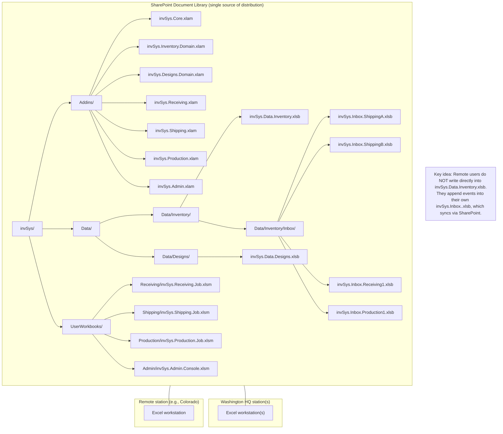

# invSys v2 Architecture Diagrams (Mermaid)

## 1) Directory structure (repo)

---

## 2) File diagram (SharePoint-synced, supports out-of-state users)

---

## 3) Inventory workflow combinations (explicit off-local-network flow, role inboxes, lock order, logs)

### Core-owned capability check (important point)

* Role XLAMs may show UI and collect inputs.
* **Only Core** authorizes actions (`Core.CanPerform`).
* Remote users create **events** in their role-specific inbox file.
* The HQ processor applies events to authoritative `.xlsb` with domain XLAM rules.
* **Lock order** during processing: **Inventory first**, then **Designs only if needed**.
* **InventoryLog** is written in `invSys.Data.Inventory.xlsb`.
* **ProductionRuns** is written in `invSys.Data.Designs.xlsb`.