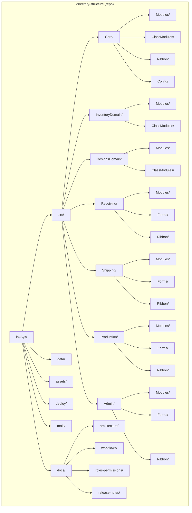
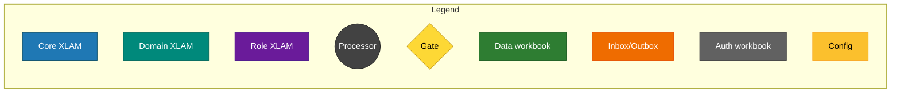
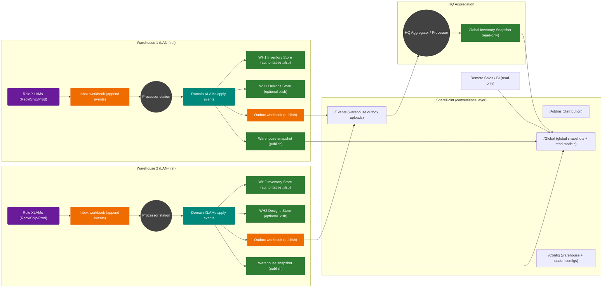
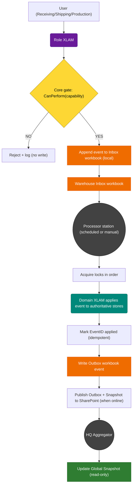
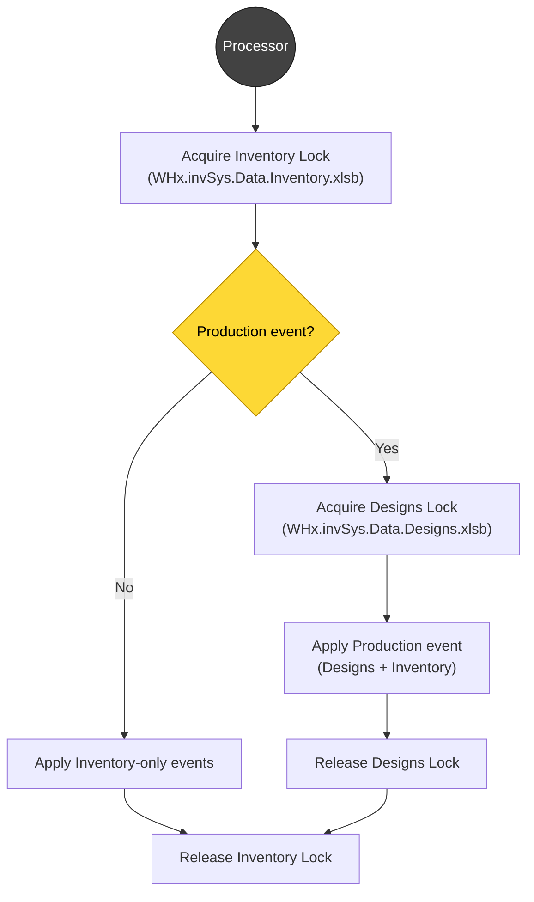
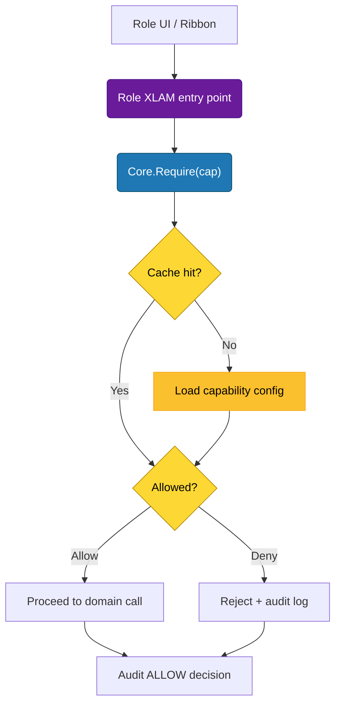
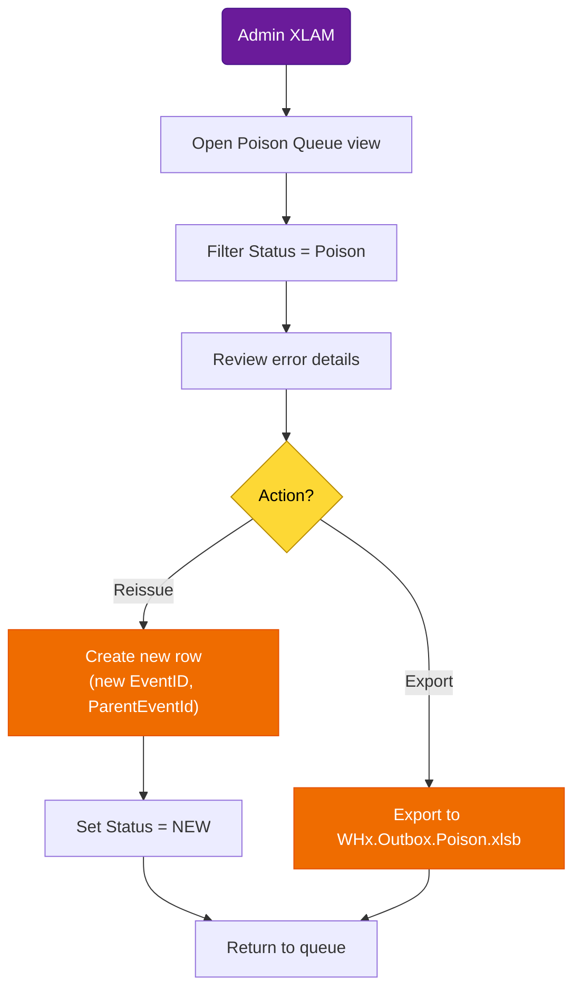

# invSys Architecture v2 -- Consolidated & Corrected (Draft)

## Purpose
This document replaces the overlapping/duplicated architecture notes and diagrams scattered across earlier files. It **chooses one coherent model**, updates the diagrams to match that model, and removes the prior contradictions.

## Decisions (draft)
### D1 -- One write model everywhere: inbox/outbox + processor (no direct-writes)
All domain state changes happen by **appending events** into an **inbox** (and/or publishing **outbox** events). A **processor** is the only component that applies events to authoritative data stores.

### D2 -- Multi-warehouse, LAN-first, SharePoint as convenience layer
Each warehouse has **local authoritative Excel workbooks** (inventory and optionally designs) and can operate when internet is down. Warehouses **publish outbox workbooks** (and periodic snapshot workbooks) to a **SharePoint team document library** when online. HQ aggregates events and produces a **global snapshot workbook** for cross-warehouse visibility.

### D3 -- Clear ownership boundary
- **Core**: authorization gate, orchestration, config, lock manager, processor runner, shared utilities.
- **Domain XLAMs**: **all writes** to authoritative data stores + domain invariants.
- **Role XLAMs** (Receiving/Shipping/Production): UI + event creation only.
- **Admin XLAM**: orchestration console only (invokes Core + domain routines; does not write domain tables directly).

### D4 -- Forms strategy (explicit)
To avoid cross-project coupling and version drift, **each role add-in that needs a dynamic search form includes its own copy** (e.g., `ufDynItemSearchTemplate`, `ufDynDesignSearchTemplate`, `ufDynAdminTemplate`).  
Core does not promise "shared forms only."

---

## Repo structure


Notes:
- Shared "Core/Forms" is intentionally **not** a repo contract in this version (see D4).

---

## Diagram legend and styling (draft)

Use the following mapping for all diagrams in this doc.

**Shapes**
- **XLAM add-ins**: rounded rectangles
- **Workbooks / files**: plain rectangles
- **Processor**: double-circle
- **Gates**: diamonds

**Colors**
- Core XLAM: blue
- Domain XLAM: teal
- Role XLAM: purple
- Data workbooks: green
- Queue workbooks: orange
- Auth workbook: gray
- Config: yellow



---

## Deployment topology (multi-warehouse)
### Conceptual: warehouses operate locally; SharePoint is sync + distribution



Key intent:
- Each warehouse writes only to its **local authoritative Excel workbooks**.
- Warehouses publish **outbox workbooks** to SharePoint when online (via M365 sync client).
- HQ produces a **global snapshot workbook** for cross-warehouse visibility.
- Remote consumers read snapshots; they do not write inventory directly.

---

## Proposed SharePoint folder layout

```mermaid
flowchart TB
  subgraph SPROOT["SharePoint Library: invSys/"]
    ROOT["invSys/"]
    ROOT --> A["Addins/"]
    ROOT --> E["Events/"]
    ROOT --> G["Global/"]
    ROOT --> C["Config/"]
    ROOT --> AU["Auth/"]
    ROOT --> D["Docs/"]
  end

  %% add-ins
  A --> ACore("invSys.Core.xlam"):::core
  A --> AInvDom("invSys.Inventory.Domain.xlam"):::domain
  A --> ADesDom("invSys.Designs.Domain.xlam"):::domain
  A --> ARecv("invSys.Receiving.xlam"):::role
  A --> AShip("invSys.Shipping.xlam"):::role
  A --> AProd("invSys.Production.xlam"):::role
  A --> AAdm("invSys.Admin.xlam"):::role

  %% events
  E --> EWh1["WH1.Outbox.Events.xlsb"]:::queue
  E --> EWh2["WH2.Outbox.Events.xlsb"]:::queue

  %% global outputs
  G --> GSnp["invSys.Global.InventorySnapshot.xlsb"]:::data
  G --> GDes["invSys.Global.DesignsSnapshot.xlsb"]:::data
  G --> GViews["Read models / exports (optional)"]

  %% configs
  C --> CWh["WHx.invSys.Config.xlsb (warehouse + station config)"]:::config

  %% auth
  AU --> AWh["WHx.invSys.Auth.xlsb"]:::auth

  classDef core fill:#1f78b4,stroke:#0b4f6c,color:#ffffff;
  classDef domain fill:#00897b,stroke:#00695c,color:#ffffff;
  classDef role fill:#6a1b9a,stroke:#4a148c,color:#ffffff;
  classDef proc fill:#424242,stroke:#1b1b1b,color:#ffffff;
  classDef gate fill:#fdd835,stroke:#b58900,color:#000000;
  classDef data fill:#2e7d32,stroke:#1b5e20,color:#ffffff;
  classDef queue fill:#ef6c00,stroke:#e65100,color:#ffffff;
  classDef auth fill:#616161,stroke:#424242,color:#ffffff;
  classDef config fill:#fbc02d,stroke:#f9a825,color:#000000;
```


---

## Workbook inventory (current design)

### Authoritative warehouse stores
- `WHx.invSys.Data.Inventory.xlsb` (Inventory domain; authoritative stock + inventory logs)
- `WHx.invSys.Data.Designs.xlsb` (Designs domain; optional per warehouse)
- `WHx.invSys.Auth.xlsb` (Users + capabilities; offline auth source of truth)

### Queue workbooks
- `invSys.Inbox.Receiving.<Station>.xlsb` (append-only workbook)
- `invSys.Inbox.Shipping.<Station>.xlsb` (append-only workbook)
- `invSys.Inbox.Production.<Station>.xlsb` (append-only workbook)
- `WHx.Outbox.Events.xlsb` (append-only workbook for HQ aggregation)

### Config workbooks
- `WHx.invSys.Config.xlsb` (warehouse + station config; canonical for Release 1)

### Global read models
- `invSys.Global.InventorySnapshot.xlsb` (HQ-built, read-only)
- `invSys.Global.DesignsSnapshot.xlsb` (HQ-built, read-only)

### User workbooks (optional UI/staging)
- `invSys.Receiving.Job.xlsm`
- `invSys.Shipping.Job.xlsm`
- `invSys.Production.Job.xlsm`
- `invSys.Admin.Console.xlsm`

### Critique / likely missing
- **Designs global snapshot** (needed: cross-warehouse design visibility).
- **Poison queue export** (optional; consider keeping poison rows in inbox tables for Release 1, then exporting later if you need clean separation).

---

## Non-goals (Release 1)
- Real-time cross-warehouse synchronization.
- Cross-warehouse writes to authoritative stores.
- WAN-required authentication (offline first).

---

## Runtime responsibilities and boundaries
### Core (invSys.Core.xlam)
- `Core.CanPerform(capability, identity, context)` -- authorization gate.
- `Core.Orchestrate(action, payload)` -- calls domain routines; never writes domain tables directly.
- `Core.LockManager` -- acquire/release locks in canonical lock order.
- `Core.ProcessorRunner` -- scan inboxes/outboxes; schedule batches; apply events via domain XLAMs.
- `Core.Config` -- load warehouse/station config.
- `Core.UndoRedo` -- issue compensating events (`UndoOfEventId`) when `UNDO_APPLY` is authorized.

### Inventory Domain (invSys.Inventory.Domain.xlam)
- Owns schema and writes for inventory store(s).
- Applies inventory-related events to authoritative `.xlsb`.
- Writes logs (`InventoryLog`) and maintains idempotency (`tblAppliedEvents`) in `WHx.invSys.Data.Inventory.xlsb` (canonical idempotency ledger).
- Validates required tables on open; if a required table is missing or corrupted, it **regenerates it from schema defaults** (Release 1 self-repair).

### Designs Domain (invSys.Designs.Domain.xlam)
- Owns schema and writes for designs/BOM store(s).
- Provides BOM lookup/versioning used by Production processing when required.
- Validates required tables on open; if a required table is missing or corrupted, it **regenerates it from schema defaults** (Release 1 self-repair).

### Role XLAMs (Receiving/Shipping/Production)
- UI and workflow.
- Create events to inbox/outbox; do not write authoritative stores.
- Embed their own dynamic search forms per D4.

### Admin XLAM (invSys.Admin.xlam)
- Admin console: run processor, manage config, validate deployment, view logs.
- Orchestrates by calling Core + domain routines; does not mutate tables directly.

---

## Workflow: event creation -> sync -> processing


---

## Locking model
### Lock order (deadlock avoidance)
1) **Inventory**  
2) **Designs** (only when required, e.g., Production needing BOM/version)

### Lock record placement
- Locks are stored **inside the authoritative warehouse store** (e.g., `WH1.invSys.Data.Inventory.xlsb`, `WH1.invSys.Data.Designs.xlsb`).
- Each lock row includes: `LockName`, `OwnerStationId`, `OwnerUser`, `AcquiredAt`, `ExpiresAt`, `HeartbeatAt`, `RunId`.

### Lock table layout (Release 1)

**Workbook:** `WHx.invSys.Data.Inventory.xlsb` and `WHx.invSys.Data.Designs.xlsb`  
**Table:** `tblLocks`

```text
LockName       (text, PK)   INVENTORY | DESIGNS
OwnerStationId (text)
OwnerUserId    (text)
RunId          (text)
AcquiredAtUTC  (datetime)
ExpiresAtUTC   (datetime)
HeartbeatAtUTC (datetime)
Status         (text)       HELD | EXPIRED | BROKEN
```

### Heartbeat cadence (Release 1)
- Processor updates `HeartbeatAtUTC` **every 30 seconds** while holding locks.
- `ExpiresAtUTC` is set to `NowUTC + 3 minutes` and is extended on each heartbeat.
- If `NowUTC > ExpiresAtUTC` and no heartbeat progress, the lock is considered **expired**.

### Break-lock workflow (Release 1)
1) Admin requests break-lock in Admin XLAM.
2) Core verifies `ADMIN_MAINT` for the same warehouse.
3) Core writes an audit entry (who/when/reason).
4) Core sets lock `Status = BROKEN`, clears owner fields, and updates `HeartbeatAtUTC`.
5) Processor may retry acquisition on the next run.
### Locking and unlocking sequence (mermaid)



### Timeouts & orphan recovery
- Processor acquires lock with retry/backoff.
- If `ExpiresAt < Now` and no heartbeat progress, lock can be broken by Admin with an audit log entry.
- **Break-lock authority**: requires `ADMIN_MAINT` scoped to the same warehouse.
- Every processor run is assigned a `RunId` used in logs and lock rows.

---

## Capability enforcement
### Capability source of truth
- Stored in a dedicated **auth workbook** per warehouse: `WHx.invSys.Auth.xlsb`.
- **JSON is not used in Release 1; the workbook is canonical.**
- Cached locally with a TTL; invalidated on version bump.

### Identity resolution (chosen path)
**Option A (Release 1) is the chosen development path:** workbook-stored users + PIN.  
Users are defined inside invSys data, authenticated locally with a PIN (or short passcode), and resolved entirely offline.

Option B (Windows identity / AD groups) is deferred for a later release.

Core always evaluates capability via the selected identity provider.

### Capabilities (baseline set)
Start with a small, explicit set and expand only when needed:
- `RECEIVE_POST`, `SHIP_POST`, `PROD_POST`
- `INBOX_PROCESS`
- `ADMIN_USERS`, `ADMIN_MAINT`, `DESIGN_RELEASE`
- `UNDO_APPLY` (issue compensating events)

### Enforcement points (must all align)
1) **UI gating (Role XLAM)**: hide/disable buttons if `Core.CanPerform` returns false.
2) **Core gate (authoritative)**: all role and admin entry points call `Core.Require(cap)`.
3) **Processor gate**: inbox processing requires `INBOX_PROCESS` capability.

### Suggested capability schema (workbook)
Minimum fields:
- `UserId` (or `UserKey`)
- `Role` (optional helper)
- `Capability` (string enum)
- `WarehouseId` (scope; optional wildcard)
- `StationId` (scope; optional wildcard)
- `Status` (Active/Disabled)
- `ValidFrom`, `ValidTo` (optional)

### Evaluation rules (Core.CanPerform)
- Resolve identity -> determine `UserId`.
- Match on `UserId` plus scope rules (warehouse/station).
- Deny by default if no match.
- Support explicit **deny** entries if needed (deny overrides allow).
- Cache results for a short TTL; invalidate on config version change.

### Audit trail (required)
Every gate decision should log:
- `EventId` or `RequestId`
- `UserId`, `Capability`, `WarehouseId`, `StationId`
- `Result` (ALLOW/DENY)
- `Timestamp`, `Source` (UI, Processor, Admin)

### Offline behavior
- Cached capabilities remain valid until TTL expiry.
- If config cannot be refreshed and cache expired, **fail closed** for write operations.
- If TTL expires **mid-run**, the processor completes the current run using the cached snapshot; a refresh is required before the next run.

### Admin overrides (if allowed)
If you allow a break-glass override, define:
- Which capabilities can be overridden (if any)
- Required logging fields (reason, approver)
- Time-bound override expiry

### Capability check flow (Mermaid)


### Sample capability table (minimal)
```text
tblCapabilities
  UserId        (text)  e.g., "jsmith"
  Capability    (text)  e.g., "SHIP_POST"
  WarehouseId   (text)  e.g., "WH1" or "*"
  StationId     (text)  e.g., "S1" or "*"
  Status        (text)  "Active" | "Disabled"
  ValidFrom     (date)  optional
  ValidTo       (date)  optional
  Notes         (text)  optional
```

---

## Processor semantics
The **processor** is VBA logic running in an Excel session on a designated processor station (typically invoked from the Admin XLAM). It can be launched manually, on a schedule (Task Scheduler), or via `Application.OnTime`.
If a required table is missing or corrupted, the user can **close and reopen** the workbook; the domain add-ins will regenerate required tables on open (Release 1 self-repair).

### Processing loop
- Read inbox rows ordered by `(CreatedAt, Sequence)` **per inbox**, then merge across inboxes using a stable tie-breaker (e.g., `InboxId`, `RowId`) to allow interleaving without global locking.
- For each row:
  - Validate schema + signature (if used)
  - Check idempotency: if `EventID` already applied -> skip and mark as duplicate
  - Acquire locks (Inventory then Designs if required)
  - Apply event through domain XLAM routine
  - Commit log entries + applied marker
  - Release locks
Crash safety rule: If the processor crashes before the applied marker is written, the event is treated as not applied and will be retried. Domain apply routines must guarantee that no partial effects escape the lock boundary: either the operation is fully applied and recorded before lock release, or all intermediate effects are rolled back. Domain routines must therefore be restart-safe and idempotent with respect to reprocessing.

### Poison rows
If an event fails validation or repeatedly fails application:
- Mark `Status = Poison`
- Capture `ErrorCode`, `ErrorMessage`, `FailedAt`, `RetryCount`
- Do not block the rest of the queue; continue
**Retry rule (Release 1):** poison rows are immutable; retries must be inserted as a **new row with a new `EventID`**, linking to the original via `ParentEventId`.

### Partial failure rule
- Treat each event as atomic with respect to its domain writes.
- If an event spans domains (e.g., Production touching BOM + Inventory), require both locks and commit in a single controlled apply routine.

### Retry + poison handling (Release 1)
**Admin UI flow**
1) Admin opens the **Poison Queue** view (Admin XLAM).
2) Admin filters by `Status = Poison` and reviews error details.
3) Admin chooses **Reissue** (recommended) or **Export** (optional).

**Reissue rules**
- Poison rows are **not edited** in place.
- Reissue creates a **new row** with a new `EventID`, and sets:
  - `ParentEventId = <original EventID>`
  - `Status = NEW`
  - `RetryCount = original RetryCount + 1`
- The original row remains as audit history.

**Optional export format**
- Export produces a workbook `WHx.Outbox.Poison.xlsb` with table `tblPoisonEvents`.
- Schema mirrors the source inbox row plus:
  - `ExportedAtUTC`, `ExportedBy`
- Use export only for external review or bulk correction; reissue still creates new rows.

**Admin flow diagram (Mermaid)**


### Inbox granularity vs processor scope (Release 1)
- **Inbox per station**; **processor per warehouse**.
- Processor scans **all station inboxes for that warehouse** in a single run.
- Processing is **serialized per warehouse** (single processor run at a time).
- Within a run, events may be interleaved across inboxes, but **lock order remains global** (Inventory then Designs).
- Poison rows in one station **do not block** other stations; they are skipped and flagged.

### Outbox schema (proposed)
- Outbox is **derived from inbox** plus processor metadata (not a duplicate table).
- Payload should be **normalized and minimal**:
  - `EventId`, `EventType`, `WarehouseId`, `StationId`, `OccurredAtUTC`
  - `AppliedAtUTC`, `AppliedBy`, `RunId`
  - `Delta` fields only (no full before/after snapshots)
- If a consumer needs before/after, use **warehouse snapshots** instead of outbox rows.

### Snapshot cadence (Release 1)
- **Warehouse snapshot**: produced by the warehouse processor **per batch** (not per event).
- **Global snapshot**: produced by HQ aggregator on a **schedule** (e.g., hourly) or after receiving new outbox files.
- Consistency: **eventually consistent** across warehouses; local warehouse snapshot is consistent for that warehouse at the end of the batch.

### Snapshot format (Release 1)

**Warehouse snapshots (per warehouse)**
- Inventory snapshot workbook: `WHx.invSys.Snapshot.Inventory.xlsb`
  - `tblSnapshotOnHand` (WarehouseId, SKU, Location, QtyOnHand, AsOfUTC)
  - `tblSnapshotItems` (SKU, Description, UOM, Category, Active)
- Designs snapshot workbook: `WHx.invSys.Snapshot.Designs.xlsb` (if designs are used locally)
  - `tblSnapshotDesigns` (DesignId, Version, Status, UOM, AsOfUTC)
  - `tblSnapshotBOM` (DesignId, Version, ComponentSKU, QtyPerUnit, ScrapFactor, AsOfUTC)

**Global snapshots (HQ-built)**
- Inventory snapshot: `invSys.Global.InventorySnapshot.xlsb`
  - `tblGlobalOnHand` (WarehouseId, SKU, Location, QtyOnHand, AsOfUTC)
- Designs snapshot: `invSys.Global.DesignsSnapshot.xlsb`
  - `tblGlobalDesigns` (DesignId, Version, Status, UOM, AsOfUTC)
  - `tblGlobalBOM` (DesignId, Version, ComponentSKU, QtyPerUnit, ScrapFactor, AsOfUTC)

### Snapshot retention (Release 1)
- Keep the **latest** snapshot per warehouse locally.
- Keep the **latest** global snapshots on SharePoint.
- Optional: keep a **daily rolling 7-day** archive if storage permits.

### Processor scheduling (Release 1)

**Run modes**
- **Manual**: Admin XLAM button "Run Processor".
- **Scheduled**: Windows Task Scheduler opens Excel and runs the Admin XLAM macro.
- **OnTime**: optional `Application.OnTime` loop for always-on stations.

**Batch size**
- Default: process **up to 500 events per run** across all inboxes.
- If more remain, schedule the next run immediately (or after a short delay).

**Performance bounds (initial targets)**
- Target throughput: **100+ events/minute** on a typical workstation.
- Lock hold time: **< 2 minutes** per batch.
- If a batch exceeds 2 minutes, log a warning and reduce batch size.

### Undo / Redo (Release 1)
- Undo/redo is implemented as **compensating events** (never editing logs in place).
- An undo creates a new event with `UndoOfEventId` pointing to the original.
- Redo reissues the original event as a new EventID (also tracked via `ParentEventId`).
- Requires `UNDO_APPLY` capability and is logged in the same audit trail.

### Backup and restore policy (Release 1)

**Cadence**
- **Auth workbook** (`WHx.invSys.Auth.xlsb`): daily backup.
- **Inventory/Designs stores**: nightly backup (per warehouse).
- **Snapshots**: no backups required beyond retention rules (they are rebuildable).

**Retention**
- Keep **7 daily** backups locally.
- Keep **4 weekly** backups (rolling) if storage permits.
- Store at least one monthly backup offsite (SharePoint or external).

**Backup method (explicit)**
- Backup = **file copy of a closed Excel workbook** (`.xlsb`) to a local backup folder (e.g., `C:\invSysBackups\WHx\`).
- Offsite copy = **file copy** to SharePoint `/Backups/WHx/` (optional but recommended).

**Restore playbook (high level)**
1) Stop processor runs for the affected warehouse.
2) Restore the latest known-good backup of the target workbook.
3) Verify schema version and table integrity.
4) Resume processor runs; reprocess any un-applied inbox rows (idempotent).
5) Log the restore in Admin audit log with reason + timestamp.

### Auth workbook lifecycle (Release 1)
- **Created by Admin XLAM** using a domain-owned initializer (not manual).
- **Versioned** by schema version + migration scripts; upgrades are additive when possible.
- **Recovery**: Admin can rebuild from last known backup or regenerate with a known-good template.
- **Locking**: use the same lock pattern as domain stores when mutating auth data.

---

## What still needs concrete specification (next pass)
All Phase-1 specifications have been added. The next phase is **critique and validation**:
1) Internal consistency checks (no conflicts across diagrams/sections).
2) Feasibility checks in VBA/Excel constraints (performance, file locks, SharePoint behavior).
3) Security review (PIN handling, lock break authority, audit completeness).
4) Operational review (processor scheduling, backup/restore, self-repair behavior).

---

## Schema drafts (Release 1)

The following tables are the proposed minimum schemas. Names are fixed; columns can expand later.

### Inbox tables (per station workbook)

**Workbook:** `invSys.Inbox.<Role>.<Station>.xlsb`

**tblInboxReceive**
```text
EventID        (text, PK)
ParentEventId  (text, optional)
UndoOfEventId  (text, optional)
CreatedAtUTC   (datetime)
WarehouseId    (text)
StationId      (text)
UserId         (text)
SKU            (text)
Qty            (number)
Location       (text)
Note           (text, optional)
Status         (text)   NEW | PROCESSED | SKIP_DUP | POISON
RetryCount     (number)
ErrorCode      (text, optional)
ErrorMessage   (text, optional)
FailedAtUTC    (datetime, optional)
```

**tblInboxShip**
```text
EventID        (text, PK)
ParentEventId  (text, optional)
UndoOfEventId  (text, optional)
CreatedAtUTC   (datetime)
WarehouseId    (text)
StationId      (text)
UserId         (text)
SKU            (text)
Qty            (number)
Location       (text)
Destination    (text, optional)
Note           (text, optional)
Status         (text)   NEW | PROCESSED | SKIP_DUP | POISON
RetryCount     (number)
ErrorCode      (text, optional)
ErrorMessage   (text, optional)
FailedAtUTC    (datetime, optional)
```

**tblInboxProd**
```text
EventID        (text, PK)
ParentEventId  (text, optional)
UndoOfEventId  (text, optional)
CreatedAtUTC   (datetime)
WarehouseId    (text)
StationId      (text)
UserId         (text)
DesignId       (text)
DesignVersion  (text)
QtyPlanned     (number)
Location       (text, optional)
Note           (text, optional)
Status         (text)   NEW | PROCESSED | SKIP_DUP | POISON
RetryCount     (number)
ErrorCode      (text, optional)
ErrorMessage   (text, optional)
FailedAtUTC    (datetime, optional)
```

### Outbox table (per warehouse)

**Workbook:** `WHx.Outbox.Events.xlsb`

**tblOutboxEvents**
```text
EventID        (text, PK)
UndoOfEventId  (text, optional)
EventType      (text)   RECEIVE | SHIP | PROD | UNDO
WarehouseId    (text)
StationId      (text)
OccurredAtUTC  (datetime)
AppliedAtUTC   (datetime)
AppliedBy      (text)
RunId          (text)
DeltaJson      (text)   minimal delta payload (no before/after)
```

### Inventory domain tables (authoritative)

**Workbook:** `WHx.invSys.Data.Inventory.xlsb`

**tblInventoryLog**
```text
EventID        (text, PK)
UndoOfEventId  (text, optional)
AppliedSeq     (number)  global apply order
EventType      (text)
OccurredAtUTC  (datetime)
AppliedAtUTC   (datetime)
WarehouseId    (text)
StationId      (text)
UserId         (text)
SKU            (text)
QtyDelta       (number)
Location       (text)
Note           (text, optional)
```

**tblAppliedEvents**
```text
EventID        (text, PK)
UndoOfEventId  (text, optional)
AppliedSeq     (number)  global apply order
AppliedAtUTC   (datetime)
RunId          (text)
SourceInbox    (text)
Status         (text)   APPLIED | SKIP_DUP
```

### Designs domain tables (authoritative)

**Workbook:** `WHx.invSys.Data.Designs.xlsb`

**tblProductionRuns**
```text
RunID          (text, PK)
EventID        (text)
DesignId       (text)
DesignVersion  (text)
WarehouseId    (text)
StationId      (text)
UserId         (text)
QtyPlanned     (number)
QtyActual      (number, optional)
Status         (text)   PLANNED | COMPLETE | VOID
CreatedAtUTC   (datetime)
AppliedAtUTC   (datetime)
```

### Auth tables

**Workbook:** `WHx.invSys.Auth.xlsb`

**tblUsers**
```text
UserId         (text, PK)
DisplayName    (text)
PinHash        (text)
Status         (text)   Active | Disabled
ValidFrom      (date, optional)
ValidTo        (date, optional)
```

**tblCapabilities**
```text
UserId        (text)
Capability    (text)
WarehouseId   (text)   WH1 or *
StationId     (text)   S1 or *
Status        (text)   Active | Disabled
ValidFrom     (date, optional)
ValidTo       (date, optional)
```

### Config tables

**Workbook:** `WHx.invSys.Config.xlsb`

**tblWarehouseConfig**
```text
WarehouseId   (text, PK)
WarehouseName (text)
Timezone      (text)
DefaultLocation (text)
```

**tblStationConfig**
```text
StationId     (text, PK)
WarehouseId   (text)
StationName   (text)
RoleDefault   (text)  RECEIVE | SHIP | PROD | ADMIN
```

---

## Appendix -- Terminology
- **Inbox**: a multi-writer-friendly append-only queue of events.
- **Outbox**: a publishable stream of applied events, used for cross-site sync.
- **Processor**: the Admin XLAM VBA routine that runs in an Excel session (manual, scheduled task, or `Application.OnTime`) to apply events to authoritative stores.
- **Authoritative store**: warehouse-local `.xlsb` (Inventory, Designs) that is the source of truth for that warehouse.
- **Global snapshot**: read-only consolidated view produced by HQ aggregation.
